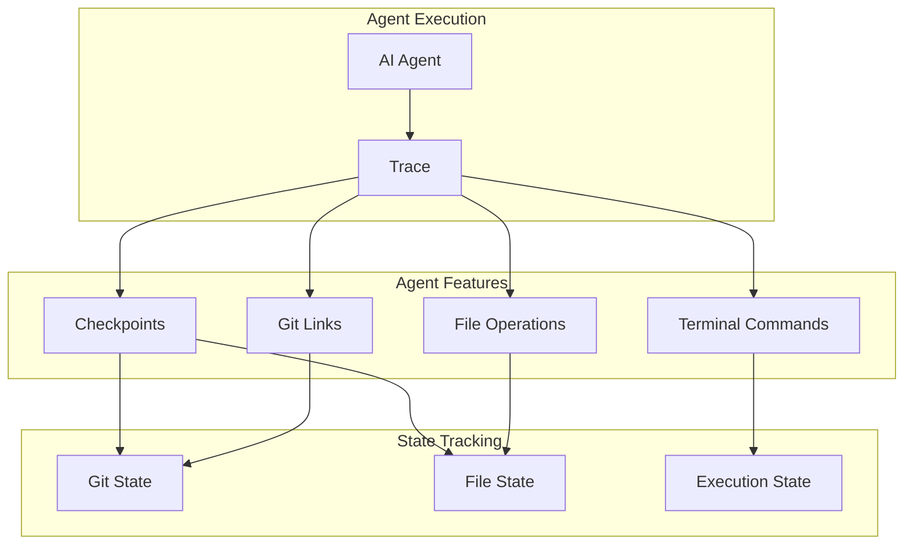

# Agent Features

AgentTrace provides specialized observability features designed for AI coding agents: checkpoints for state snapshots, git linking for commit correlation, file operation tracking, and terminal command logging.

## Overview



These features enable:
- **Debugging**: Understand exactly what an agent did and when
- **Reproducibility**: Restore to previous states and re-run
- **Auditing**: Complete record of agent modifications
- **CI/CD Integration**: Correlate agent runs with commits and deployments

---

## Checkpoints

Checkpoints create snapshots of code state during agent execution, enabling state restoration and debugging.

### Checkpoint Types

| Type | Description | Use Case |
|------|-------------|----------|
| `manual` | Explicitly created by code | Before major changes |
| `auto` | Automatically created | Periodic snapshots |
| `tool_call` | Before/after tool execution | Tool debugging |
| `error` | Created on errors | Error recovery |
| `milestone` | Key progress points | Task completion |
| `restore` | After restoring state | Recovery tracking |

### Creating Checkpoints

#### Python

```python
import agenttrace

client = agenttrace.AgentTrace()

with client.trace("code-refactor") as trace:
    # Create checkpoint before making changes
    cp = trace.checkpoint(
        name="before-refactor",
        type="manual",
        files=["src/main.py", "src/utils.py"],
        description="State before refactoring utils module"
    )

    print(f"Checkpoint created: {cp.id}")
    print(f"Git SHA: {cp.git_commit_sha}")
    print(f"Files: {cp.total_files}, Size: {cp.total_size_bytes} bytes")

    # ... perform refactoring ...

    # Create milestone checkpoint after
    trace.checkpoint(
        name="after-refactor",
        type="milestone",
        files=["src/main.py", "src/utils.py"],
        description="Refactoring complete"
    )
```

#### TypeScript

```typescript
import { AgentTrace } from '@agenttrace/sdk';

const client = new AgentTrace({ apiKey: 'at-your-api-key' });

const trace = client.trace({ name: 'code-refactor' });

// Create checkpoint before changes
const cp = trace.checkpoint({
  name: 'before-refactor',
  type: 'manual',
  files: ['src/main.ts', 'src/utils.ts'],
  description: 'State before refactoring utils module'
});

console.log(`Checkpoint: ${cp.id}`);
console.log(`Git SHA: ${cp.gitCommitSha}`);
console.log(`Files: ${cp.totalFiles}, Size: ${cp.totalSizeBytes} bytes`);

// ... perform refactoring ...

// Create milestone checkpoint after
trace.checkpoint({
  name: 'after-refactor',
  type: 'milestone',
  files: ['src/main.ts', 'src/utils.ts']
});

trace.end();
```

#### Go

```go
package main

import (
    "context"
    "fmt"

    agenttrace "github.com/agenttrace/agenttrace-go"
)

func main() {
    client := agenttrace.New(agenttrace.Config{
        APIKey: "at-your-api-key",
    })
    defer client.Shutdown()

    ctx := context.Background()
    trace := client.Trace(ctx, agenttrace.TraceOptions{Name: "code-refactor"})

    // Create checkpoint before changes
    cp := trace.Checkpoint(agenttrace.CheckpointOptions{
        Name:        "before-refactor",
        Type:        agenttrace.CheckpointTypeManual,
        Files:       []string{"src/main.go", "src/utils.go"},
        Description: "State before refactoring utils module",
    })

    fmt.Printf("Checkpoint: %s\n", cp.ID)
    fmt.Printf("Git SHA: %s\n", cp.GitCommitSha)
    fmt.Printf("Files: %d, Size: %d bytes\n", cp.TotalFiles, cp.TotalSizeBytes)

    // ... perform refactoring ...

    // Create milestone checkpoint
    trace.Checkpoint(agenttrace.CheckpointOptions{
        Name: "after-refactor",
        Type: agenttrace.CheckpointTypeMilestone,
        Files: []string{"src/main.go", "src/utils.go"},
    })

    trace.End(nil)
}
```

### REST API

```bash
curl -X POST "https://api.agenttrace.io/v1/checkpoints" \
  -H "Authorization: Bearer at-your-api-key" \
  -H "Content-Type: application/json" \
  -d '{
    "traceId": "trace-abc-123",
    "name": "before-edit",
    "type": "manual",
    "description": "State before editing main.py",
    "filesChanged": ["src/main.py"],
    "gitCommitSha": "abc123def456",
    "gitBranch": "feature/refactor"
  }'
```

### Checkpoint Data

Each checkpoint captures:

| Field | Description |
|-------|-------------|
| `gitCommitSha` | Current git commit SHA |
| `gitBranch` | Current branch name |
| `filesSnapshot` | Map of files with size and SHA256 hash |
| `filesChanged` | List of tracked file paths |
| `totalFiles` | Number of files tracked |
| `totalSizeBytes` | Total size of tracked files |

### Querying Checkpoints

```bash
# List checkpoints for a trace
curl "https://api.agenttrace.io/v1/traces/{traceId}/checkpoints" \
  -H "Authorization: Bearer at-your-api-key"

# Get specific checkpoint
curl "https://api.agenttrace.io/v1/checkpoints/{id}" \
  -H "Authorization: Bearer at-your-api-key"
```

---

## Git Links

Git links correlate agent actions with git repository state, enabling commit-level traceability.

### Git Link Types

| Type | Description | Use Case |
|------|-------------|----------|
| `start` | Git state at trace start | Baseline tracking |
| `commit` | Link to a specific commit | Commit attribution |
| `restore` | After git restore/checkout | Recovery tracking |
| `branch` | Branch change | Context switching |
| `diff` | Uncommitted changes | Work in progress |

### Creating Git Links

#### Python

```python
import agenttrace

client = agenttrace.AgentTrace()

with client.trace("code-generation") as trace:
    # Auto-detect git state at start
    link = trace.git_link(type="start")
    print(f"Starting on branch: {link.branch}")
    print(f"Commit: {link.commit_sha}")

    # ... agent generates code and commits ...

    # Link to the new commit
    commit_link = trace.git_link(
        type="commit",
        commit_message="feat: add user authentication"
    )
    print(f"Committed: {commit_link.commit_sha}")
    print(f"Files changed: {commit_link.files_changed}")
```

#### TypeScript

```typescript
import { AgentTrace } from '@agenttrace/sdk';

const client = new AgentTrace({ apiKey: 'at-your-api-key' });

const trace = client.trace({ name: 'code-generation' });

// Auto-detect git state
const link = trace.gitLink({ type: 'start' });
console.log(`Starting on branch: ${link.branch}`);
console.log(`Commit: ${link.commitSha}`);

// ... agent generates code and commits ...

// Link to new commit
const commitLink = trace.gitLink({
  type: 'commit',
  commitMessage: 'feat: add user authentication'
});
console.log(`Committed: ${commitLink.commitSha}`);
console.log(`Files changed: ${commitLink.filesChanged}`);

trace.end();
```

#### Go

```go
package main

import (
    "context"
    "fmt"

    agenttrace "github.com/agenttrace/agenttrace-go"
)

func main() {
    client := agenttrace.New(agenttrace.Config{
        APIKey: "at-your-api-key",
    })
    defer client.Shutdown()

    ctx := context.Background()
    trace := client.Trace(ctx, agenttrace.TraceOptions{Name: "code-generation"})

    // Auto-detect git state
    link := trace.GitLink(&agenttrace.GitLinkOptions{
        Type:       agenttrace.GitLinkTypeStart,
        AutoDetect: true,
    })
    fmt.Printf("Starting on branch: %s\n", link.Branch)
    fmt.Printf("Commit: %s\n", link.CommitSha)

    // ... agent generates code and commits ...

    // Link to new commit
    commitLink := trace.GitLink(&agenttrace.GitLinkOptions{
        Type:          agenttrace.GitLinkTypeCommit,
        CommitMessage: "feat: add user authentication",
    })
    fmt.Printf("Committed: %s\n", commitLink.CommitSha)

    trace.End(nil)
}
```

### REST API

```bash
curl -X POST "https://api.agenttrace.io/v1/git-links" \
  -H "Authorization: Bearer at-your-api-key" \
  -H "Content-Type: application/json" \
  -d '{
    "traceId": "trace-abc-123",
    "linkType": "commit",
    "commitSha": "abc123def456",
    "branch": "main",
    "commitMessage": "feat: add user authentication",
    "authorName": "Agent",
    "authorEmail": "agent@example.com",
    "filesChanged": ["src/auth.py", "tests/test_auth.py"],
    "additions": 150,
    "deletions": 20
  }'
```

### Git Link Data

Each git link captures:

| Field | Description |
|-------|-------------|
| `commitSha` | Git commit SHA |
| `branch` | Branch name |
| `repoUrl` | Repository URL |
| `commitMessage` | Commit message |
| `authorName` | Commit author name |
| `authorEmail` | Commit author email |
| `filesChanged` | List of changed files |
| `additions` | Lines added |
| `deletions` | Lines deleted |

### Auto-Detection

When `autoDetect` is enabled (default), the SDK automatically gathers:
- Current commit SHA via `git rev-parse HEAD`
- Current branch via `git rev-parse --abbrev-ref HEAD`
- Remote URL via `git config --get remote.origin.url`
- Changed files via `git diff --name-only`
- Commit message via `git log -1 --format=%s`
- Author info via `git log -1 --format=%an/%ae`

---

## File Operations

Track file reads, writes, edits, and other operations performed during agent execution.

### Operation Types

| Type | Description |
|------|-------------|
| `create` | New file created |
| `read` | File read |
| `update` | File modified |
| `delete` | File deleted |
| `rename` | File renamed |
| `copy` | File copied |
| `move` | File moved |
| `chmod` | Permissions changed |

### Tracking File Operations

#### Python

```python
import agenttrace

client = agenttrace.AgentTrace()

with client.trace("code-edit") as trace:
    # Track a file edit
    op = trace.file_op(
        operation="update",
        file_path="src/main.py",
        content_before=old_content,
        content_after=new_content,
        tool_name="edit",
        reason="Adding error handling"
    )

    print(f"Operation: {op.operation}")
    print(f"Lines added: {op.lines_added}")
    print(f"Lines removed: {op.lines_removed}")
    print(f"Duration: {op.duration_ms}ms")

    # Track file creation
    trace.file_op(
        operation="create",
        file_path="src/utils.py",
        content_after=new_file_content,
        tool_name="write"
    )
```

#### TypeScript

```typescript
import { AgentTrace } from '@agenttrace/sdk';

const client = new AgentTrace({ apiKey: 'at-your-api-key' });

const trace = client.trace({ name: 'code-edit' });

// Track a file edit
const op = trace.fileOp({
  operation: 'update',
  filePath: 'src/main.ts',
  contentBefore: oldContent,
  contentAfter: newContent,
  toolName: 'edit',
  reason: 'Adding error handling'
});

console.log(`Operation: ${op.operation}`);
console.log(`Lines added: ${op.linesAdded}`);
console.log(`Lines removed: ${op.linesRemoved}`);
console.log(`Duration: ${op.durationMs}ms`);

// Track file creation
trace.fileOp({
  operation: 'create',
  filePath: 'src/utils.ts',
  contentAfter: newFileContent,
  toolName: 'write'
});

trace.end();
```

#### Go

```go
package main

import (
    "context"
    "fmt"

    agenttrace "github.com/agenttrace/agenttrace-go"
)

func main() {
    client := agenttrace.New(agenttrace.Config{
        APIKey: "at-your-api-key",
    })
    defer client.Shutdown()

    ctx := context.Background()
    trace := client.Trace(ctx, agenttrace.TraceOptions{Name: "code-edit"})

    // Track a file edit
    op := trace.FileOp(agenttrace.FileOperationOptions{
        Operation:     agenttrace.FileOpUpdate,
        FilePath:      "src/main.go",
        ContentBefore: oldContent,
        ContentAfter:  newContent,
        ToolName:      "edit",
        Reason:        "Adding error handling",
    })

    fmt.Printf("Operation: %s\n", op.Operation)
    fmt.Printf("Lines added: %d\n", op.LinesAdded)
    fmt.Printf("Lines removed: %d\n", op.LinesRemoved)
    fmt.Printf("Duration: %dms\n", op.DurationMs)

    // Track file creation
    trace.FileOp(agenttrace.FileOperationOptions{
        Operation:    agenttrace.FileOpCreate,
        FilePath:     "src/utils.go",
        ContentAfter: newFileContent,
        ToolName:     "write",
    })

    trace.End(nil)
}
```

### REST API

```bash
curl -X POST "https://api.agenttrace.io/v1/file-operations" \
  -H "Authorization: Bearer at-your-api-key" \
  -H "Content-Type: application/json" \
  -d '{
    "traceId": "trace-abc-123",
    "operation": "update",
    "filePath": "src/main.py",
    "fileSize": 2048,
    "contentHash": "abc123...",
    "linesAdded": 15,
    "linesRemoved": 5,
    "diffPreview": "@@ -10,5 +10,15 @@\n...",
    "toolName": "edit",
    "reason": "Adding error handling",
    "success": true,
    "durationMs": 150
  }'
```

### File Operation Data

Each operation captures:

| Field | Description |
|-------|-------------|
| `filePath` | Path to the file |
| `newPath` | New path (for rename/move) |
| `fileSize` | File size in bytes |
| `contentHash` | SHA256 hash of content |
| `linesAdded` | Lines added (auto-calculated) |
| `linesRemoved` | Lines removed (auto-calculated) |
| `diffPreview` | Optional diff preview |
| `toolName` | Name of tool that made the change |
| `reason` | Why the change was made |
| `success` | Whether operation succeeded |
| `durationMs` | Operation duration |

### Context Manager

Use the context manager for automatic tracking:

```python
# Python
from agenttrace import file_op_scope

with file_op_scope(trace, "update", "src/main.py") as ctx:
    ctx["content_before"] = read_file("src/main.py")
    # ... make changes ...
    ctx["content_after"] = read_file("src/main.py")
    ctx["success"] = True
```

```typescript
// TypeScript
import { withFileOp } from '@agenttrace/sdk';

await withFileOp(client, trace.id, 'update', 'src/main.ts', async (ctx) => {
  ctx.contentBefore = await fs.readFile('src/main.ts', 'utf-8');
  // ... make changes ...
  ctx.contentAfter = await fs.readFile('src/main.ts', 'utf-8');
});
```

---

## Terminal Commands

Log terminal commands executed during agent sessions for full execution visibility.

### Tracking Commands

#### Python

```python
import agenttrace

client = agenttrace.AgentTrace()

with client.trace("build-project") as trace:
    # Track a completed command
    cmd = trace.terminal_cmd(
        command="npm",
        args=["install"],
        exit_code=0,
        stdout="added 150 packages...",
        working_directory="/project"
    )

    print(f"Command: {cmd.command} {' '.join(cmd.args)}")
    print(f"Exit code: {cmd.exit_code}")
    print(f"Duration: {cmd.duration_ms}ms")

    # Run and track a command
    result = trace.run_cmd(
        "npm",
        args=["test"],
        timeout=60.0,
        max_output_bytes=10000
    )
    print(f"Tests passed: {result.exit_code == 0}")
```

#### TypeScript

```typescript
import { AgentTrace } from '@agenttrace/sdk';

const client = new AgentTrace({ apiKey: 'at-your-api-key' });

const trace = client.trace({ name: 'build-project' });

// Track a completed command
const cmd = trace.terminalCmd({
  command: 'npm',
  args: ['install'],
  exitCode: 0,
  stdout: 'added 150 packages...',
  workingDirectory: '/project'
});

console.log(`Command: ${cmd.command} ${cmd.args.join(' ')}`);
console.log(`Exit code: ${cmd.exitCode}`);
console.log(`Duration: ${cmd.durationMs}ms`);

// Run and track a command
const result = await trace.runCmd('npm', {
  args: ['test'],
  timeout: 60000,
  maxOutputBytes: 10000
});
console.log(`Tests passed: ${result.exitCode === 0}`);

trace.end();
```

#### Go

```go
package main

import (
    "context"
    "fmt"
    "time"

    agenttrace "github.com/agenttrace/agenttrace-go"
)

func main() {
    client := agenttrace.New(agenttrace.Config{
        APIKey: "at-your-api-key",
    })
    defer client.Shutdown()

    ctx := context.Background()
    trace := client.Trace(ctx, agenttrace.TraceOptions{Name: "build-project"})

    // Track a completed command
    cmd := trace.TerminalCmd(agenttrace.TerminalCommandOptions{
        Command:          "npm",
        Args:             []string{"install"},
        ExitCode:         0,
        Stdout:           "added 150 packages...",
        WorkingDirectory: "/project",
    })

    fmt.Printf("Command: %s %v\n", cmd.Command, cmd.Args)
    fmt.Printf("Exit code: %d\n", cmd.ExitCode)
    fmt.Printf("Duration: %dms\n", cmd.DurationMs)

    // Run and track a command
    result := trace.RunCmd(ctx, "npm", &agenttrace.RunCommandOptions{
        Args:    []string{"test"},
        Timeout: 60 * time.Second,
    })
    fmt.Printf("Tests passed: %v\n", result.ExitCode == 0)

    trace.End(nil)
}
```

### REST API

```bash
curl -X POST "https://api.agenttrace.io/v1/terminal-commands" \
  -H "Authorization: Bearer at-your-api-key" \
  -H "Content-Type: application/json" \
  -d '{
    "traceId": "trace-abc-123",
    "command": "npm",
    "args": ["test"],
    "workingDirectory": "/project",
    "exitCode": 0,
    "stdout": "All tests passed",
    "stderr": "",
    "durationMs": 5000,
    "success": true
  }'
```

### Terminal Command Data

Each command captures:

| Field | Description |
|-------|-------------|
| `command` | Command name |
| `args` | Command arguments |
| `workingDirectory` | Execution directory |
| `shell` | Shell used (if any) |
| `envVars` | Environment variables (JSON) |
| `exitCode` | Process exit code |
| `stdout` | Standard output (truncated) |
| `stderr` | Standard error (truncated) |
| `stdoutTruncated` | Whether stdout was truncated |
| `stderrTruncated` | Whether stderr was truncated |
| `timedOut` | Whether command timed out |
| `killed` | Whether process was killed |
| `durationMs` | Execution duration |

### Running Commands

The `run_cmd` / `runCmd` method executes and tracks commands:

```python
# Python - run with timeout
result = trace.run_cmd(
    command="pytest",
    args=["tests/", "-v"],
    timeout=120.0,  # 2 minutes
    env={"CI": "true"},
    max_output_bytes=50000
)

if result.exit_code != 0:
    print(f"Tests failed: {result.stderr}")
```

```go
// Go - run with context timeout
ctx, cancel := context.WithTimeout(ctx, 2*time.Minute)
defer cancel()

result := trace.RunCmd(ctx, "pytest", &agenttrace.RunCommandOptions{
    Args:           []string{"tests/", "-v"},
    Env:            map[string]string{"CI": "true"},
    MaxOutputBytes: 50000,
})
```

---

## CLI Integration

The AgentTrace CLI automatically tracks agent features when wrapping commands.

### Wrap with Full Tracking

```bash
agenttrace wrap \
  --name "code-agent" \
  --watch \
  --checkpoints \
  --git \
  -- python agent.py
```

This enables:
- `--watch`: File change monitoring
- `--checkpoints`: Auto-checkpoints on file changes
- `--git`: Auto-link to git state

### MCP Server

Use the MCP server for IDE integration:

```bash
agenttrace mcp --port 8765
```

Available tools:
- `agenttrace_trace_start` - Start a trace
- `agenttrace_trace_end` - End a trace
- `agenttrace_generation` - Log LLM calls
- `agenttrace_score` - Submit scores
- `agenttrace_prompt_get` - Fetch prompts

---

## Best Practices

### Checkpoints

1. **Create before major changes**: Checkpoint before refactoring, editing multiple files, or risky operations
2. **Use meaningful names**: Names like "before-auth-refactor" are more useful than "checkpoint-1"
3. **Track relevant files**: Only track files that might need restoration
4. **Use appropriate types**: `error` for error states, `milestone` for progress points

### Git Links

1. **Link at boundaries**: Create links at trace start, after commits, and at branch changes
2. **Include commit context**: Add commit messages and file lists for context
3. **Use auto-detect**: Let the SDK gather git info automatically when possible

### File Operations

1. **Track all modifications**: Log every file read, write, edit, and delete
2. **Include content hashes**: Enables verification without storing full content
3. **Add tool context**: Include which tool made the change and why
4. **Calculate diffs**: Auto-calculate lines added/removed for metrics

### Terminal Commands

1. **Set timeouts**: Prevent runaway commands from blocking
2. **Limit output size**: Truncate large outputs to avoid storage bloat
3. **Track failures**: Log failed commands with stderr for debugging
4. **Include context**: Add tool_name and reason for audit trails

---

## API Reference

### Checkpoint Endpoints

| Method | Endpoint | Description |
|--------|----------|-------------|
| GET | `/v1/checkpoints` | List checkpoints |
| GET | `/v1/checkpoints/{id}` | Get checkpoint |
| POST | `/v1/checkpoints` | Create checkpoint |
| GET | `/v1/traces/{traceId}/checkpoints` | List trace checkpoints |

### Git Link Endpoints

| Method | Endpoint | Description |
|--------|----------|-------------|
| GET | `/v1/git-links` | List git links |
| GET | `/v1/git-links/{id}` | Get git link |
| POST | `/v1/git-links` | Create git link |
| GET | `/v1/traces/{traceId}/git-links` | List trace git links |

### File Operation Endpoints

| Method | Endpoint | Description |
|--------|----------|-------------|
| GET | `/v1/file-operations` | List file operations |
| GET | `/v1/file-operations/{id}` | Get file operation |
| POST | `/v1/file-operations` | Create file operation |
| GET | `/v1/traces/{traceId}/file-operations` | List trace file operations |

### Terminal Command Endpoints

| Method | Endpoint | Description |
|--------|----------|-------------|
| GET | `/v1/terminal-commands` | List terminal commands |
| GET | `/v1/terminal-commands/{id}` | Get terminal command |
| POST | `/v1/terminal-commands` | Create terminal command |
| GET | `/v1/traces/{traceId}/terminal-commands` | List trace commands |

---

## Related Documentation

- [Python SDK](../sdks/python.md) - Python SDK agent features
- [TypeScript SDK](../sdks/typescript.md) - TypeScript SDK agent features
- [Go SDK](../sdks/go.md) - Go SDK agent features
- [CLI Wrapper](../sdks/cli.md) - CLI with auto-tracking
