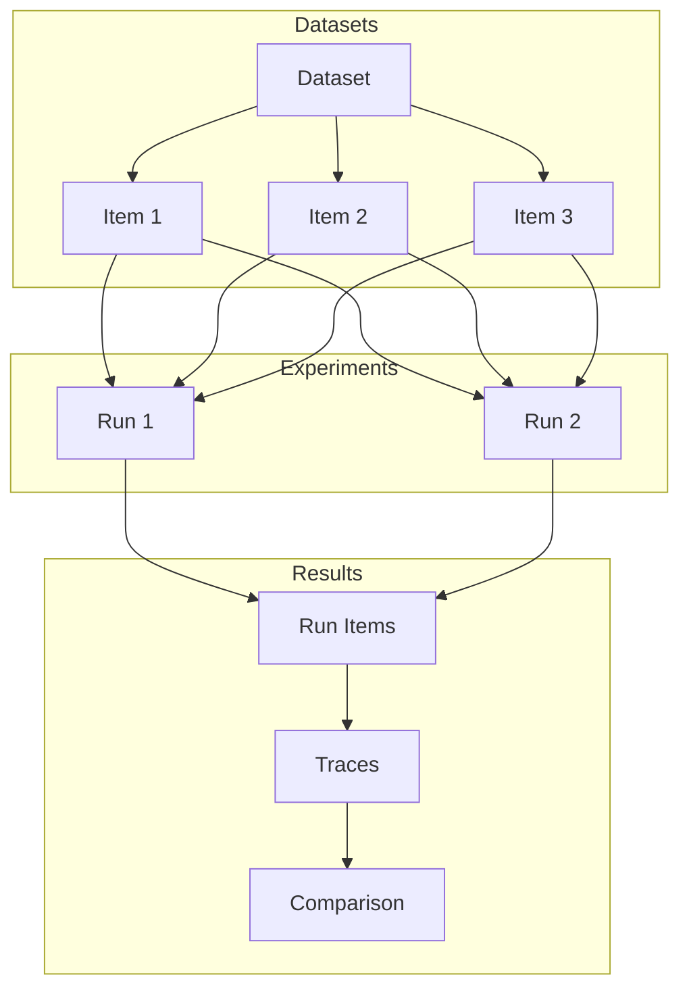
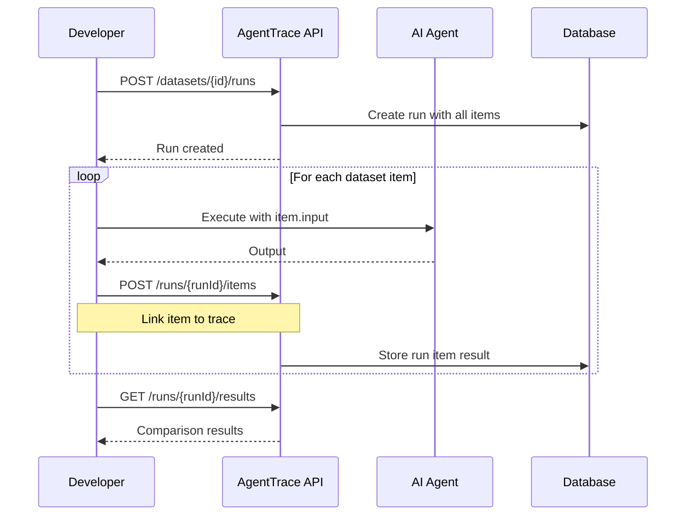

# Datasets & Experiments

AgentTrace provides a datasets framework for systematic evaluation of AI agents through curated test cases, experiment runs, and result comparison.

## Overview



## Concepts

### Datasets

A dataset is a collection of test cases (items) used to evaluate AI agent performance consistently across different runs.

| Field | Description |
|-------|-------------|
| `name` | Unique identifier for the dataset |
| `description` | Purpose and contents of the dataset |
| `itemCount` | Number of items in the dataset |
| `runCount` | Number of experiment runs executed |

### Dataset Items

Each item represents a single test case with expected behavior:

| Field | Description |
|-------|-------------|
| `input` | The input to test (JSON object) |
| `expectedOutput` | Expected output for comparison |
| `metadata` | Additional context or tags |
| `status` | `ACTIVE`, `ARCHIVED` |
| `sourceTraceId` | Optional: created from existing trace |

### Dataset Runs

A run executes all dataset items and records the results:

| Field | Description |
|-------|-------------|
| `name` | Run identifier (e.g., "v2.1-gpt4") |
| `description` | What changed in this run |
| `itemCount` | Total items to process |
| `completedCount` | Items processed so far |

### Run Items

Links dataset items to their execution traces:

| Field | Description |
|-------|-------------|
| `datasetItemId` | Reference to the test case |
| `traceId` | Execution trace for this item |
| `output` | Actual output produced |

## Creating Datasets

### REST API

```bash
curl -X POST "https://api.agenttrace.io/v1/datasets" \
  -H "Authorization: Bearer at-your-api-key" \
  -H "Content-Type: application/json" \
  -d '{
    "name": "code-review-tests",
    "description": "Test cases for code review agent"
  }'
```

Response:
```json
{
  "id": "dataset-uuid",
  "projectId": "project-uuid",
  "name": "code-review-tests",
  "description": "Test cases for code review agent",
  "itemCount": 0,
  "runCount": 0,
  "createdAt": "2024-01-15T10:00:00Z",
  "updatedAt": "2024-01-15T10:00:00Z"
}
```

### List Datasets

```bash
curl "https://api.agenttrace.io/v1/datasets" \
  -H "Authorization: Bearer at-your-api-key"
```

## Adding Items

### Manual Creation

```bash
curl -X POST "https://api.agenttrace.io/v1/datasets/{datasetId}/items" \
  -H "Authorization: Bearer at-your-api-key" \
  -H "Content-Type: application/json" \
  -d '{
    "input": {
      "code": "def add(a, b): return a + b",
      "language": "python"
    },
    "expectedOutput": {
      "issues": [],
      "suggestions": ["Add type hints"]
    },
    "metadata": {
      "category": "simple-function",
      "difficulty": "easy"
    }
  }'
```

### From Existing Trace

Create dataset items from production traces:

```bash
curl -X POST "https://api.agenttrace.io/v1/datasets/{datasetId}/items/from-trace" \
  -H "Authorization: Bearer at-your-api-key" \
  -H "Content-Type: application/json" \
  -d '{
    "traceId": "trace-abc-123",
    "observationId": "gen-xyz-789"
  }'
```

This extracts the input/output from the trace and creates a dataset item, maintaining the link via `sourceTraceId`.

### Batch Import

```bash
curl -X POST "https://api.agenttrace.io/v1/datasets/{datasetId}/items/batch" \
  -H "Authorization: Bearer at-your-api-key" \
  -H "Content-Type: application/json" \
  -d '{
    "items": [
      {
        "input": {"code": "..."},
        "expectedOutput": {"issues": []}
      },
      {
        "input": {"code": "..."},
        "expectedOutput": {"issues": ["bug"]}
      }
    ]
  }'
```

### List Items

```bash
curl "https://api.agenttrace.io/v1/datasets/{datasetId}/items" \
  -H "Authorization: Bearer at-your-api-key"
```

Response:
```json
{
  "data": [
    {
      "id": "item-uuid-1",
      "datasetId": "dataset-uuid",
      "input": {"code": "..."},
      "expectedOutput": {"issues": []},
      "metadata": {"category": "simple"},
      "status": "ACTIVE",
      "createdAt": "2024-01-15T10:00:00Z"
    }
  ],
  "totalCount": 1
}
```

## Running Experiments

### Create a Run

```bash
curl -X POST "https://api.agenttrace.io/v1/datasets/{datasetId}/runs" \
  -H "Authorization: Bearer at-your-api-key" \
  -H "Content-Type: application/json" \
  -d '{
    "name": "gpt4-v2.1",
    "description": "Testing GPT-4 with improved prompts"
  }'
```

Response:
```json
{
  "id": "run-uuid",
  "datasetId": "dataset-uuid",
  "name": "gpt4-v2.1",
  "description": "Testing GPT-4 with improved prompts",
  "itemCount": 10,
  "completedCount": 0,
  "createdAt": "2024-01-15T10:00:00Z"
}
```

### Experiment Workflow



### Record Run Item Results

As you execute each dataset item through your agent, record the results:

```bash
curl -X POST "https://api.agenttrace.io/v1/datasets/runs/{runId}/items" \
  -H "Authorization: Bearer at-your-api-key" \
  -H "Content-Type: application/json" \
  -d '{
    "datasetItemId": "item-uuid-1",
    "traceId": "trace-from-execution",
    "output": {
      "issues": [],
      "suggestions": ["Add type hints"]
    }
  }'
```

### Batch Record Results

```bash
curl -X POST "https://api.agenttrace.io/v1/datasets/runs/{runId}/items/batch" \
  -H "Authorization: Bearer at-your-api-key" \
  -H "Content-Type: application/json" \
  -d '{
    "items": [
      {
        "datasetItemId": "item-1",
        "traceId": "trace-1",
        "output": {"issues": []}
      },
      {
        "datasetItemId": "item-2",
        "traceId": "trace-2",
        "output": {"issues": ["bug"]}
      }
    ]
  }'
```

## Comparing Results

### Get Run Results

```bash
curl "https://api.agenttrace.io/v1/datasets/runs/{runId}/results" \
  -H "Authorization: Bearer at-your-api-key"
```

Response:
```json
{
  "runId": "run-uuid",
  "datasetId": "dataset-uuid",
  "totalItems": 10,
  "completedItems": 10,
  "results": [
    {
      "datasetItemId": "item-1",
      "input": {"code": "..."},
      "expectedOutput": {"issues": []},
      "actualOutput": {"issues": []},
      "traceId": "trace-1",
      "match": true,
      "similarity": 1.0
    },
    {
      "datasetItemId": "item-2",
      "input": {"code": "..."},
      "expectedOutput": {"issues": ["bug"]},
      "actualOutput": {"issues": []},
      "traceId": "trace-2",
      "match": false,
      "similarity": 0.5
    }
  ],
  "summary": {
    "matchCount": 8,
    "matchRate": 0.8,
    "avgSimilarity": 0.92
  }
}
```

### Compare Runs

Compare results across multiple experiment runs:

```bash
curl "https://api.agenttrace.io/v1/datasets/{datasetId}/runs/compare?runIds=run-1,run-2" \
  -H "Authorization: Bearer at-your-api-key"
```

Response:
```json
{
  "datasetId": "dataset-uuid",
  "runs": [
    {
      "id": "run-1",
      "name": "gpt4-v2.0",
      "matchRate": 0.75,
      "avgSimilarity": 0.88
    },
    {
      "id": "run-2",
      "name": "gpt4-v2.1",
      "matchRate": 0.80,
      "avgSimilarity": 0.92
    }
  ],
  "itemComparison": [
    {
      "datasetItemId": "item-1",
      "results": {
        "run-1": {"match": true, "similarity": 1.0},
        "run-2": {"match": true, "similarity": 1.0}
      }
    },
    {
      "datasetItemId": "item-2",
      "results": {
        "run-1": {"match": false, "similarity": 0.5},
        "run-2": {"match": true, "similarity": 0.95}
      }
    }
  ]
}
```

## SDK Integration

### Python

```python
import agenttrace

client = agenttrace.AgentTrace()

# Create dataset
dataset = client.create_dataset(
    name="code-review-tests",
    description="Test cases for code review agent"
)

# Add items
item = client.create_dataset_item(
    dataset_id=dataset.id,
    input={"code": "def add(a, b): return a + b"},
    expected_output={"issues": [], "suggestions": ["Add type hints"]}
)

# Add from existing trace
item_from_trace = client.create_dataset_item_from_trace(
    dataset_id=dataset.id,
    trace_id="trace-abc-123"
)

# Create run
run = client.create_dataset_run(
    dataset_id=dataset.id,
    name="gpt4-experiment",
    description="Testing with GPT-4"
)

# Execute and record results
for item in client.list_dataset_items(dataset.id):
    # Run your agent
    with client.trace("code-review") as trace:
        output = run_agent(item.input)
        trace.update(output=output)

    # Record result
    client.create_run_item(
        run_id=run.id,
        dataset_item_id=item.id,
        trace_id=trace.id,
        output=output
    )

# Get results
results = client.get_run_results(run.id)
print(f"Match rate: {results.summary.match_rate}")
```

### TypeScript

```typescript
import { AgentTrace } from '@agenttrace/sdk';

const client = new AgentTrace({ apiKey: 'at-your-api-key' });

// Create dataset
const dataset = await client.createDataset({
  name: 'code-review-tests',
  description: 'Test cases for code review agent'
});

// Add items
const item = await client.createDatasetItem({
  datasetId: dataset.id,
  input: { code: 'def add(a, b): return a + b' },
  expectedOutput: { issues: [], suggestions: ['Add type hints'] }
});

// Create run
const run = await client.createDatasetRun({
  datasetId: dataset.id,
  name: 'gpt4-experiment',
  description: 'Testing with GPT-4'
});

// Execute and record results
const items = await client.listDatasetItems(dataset.id);
for (const item of items) {
  const trace = client.trace({ name: 'code-review' });
  const output = await runAgent(item.input);
  trace.end({ output });

  await client.createRunItem({
    runId: run.id,
    datasetItemId: item.id,
    traceId: trace.id,
    output
  });
}

// Get results
const results = await client.getRunResults(run.id);
console.log(`Match rate: ${results.summary.matchRate}`);
```

### Go

```go
package main

import (
    "context"
    "fmt"

    agenttrace "github.com/agenttrace/agenttrace-go"
)

func main() {
    client := agenttrace.New(agenttrace.Config{
        APIKey: "at-your-api-key",
    })
    defer client.Shutdown()

    ctx := context.Background()

    // Create dataset
    dataset, _ := client.CreateDataset(ctx, agenttrace.CreateDatasetOptions{
        Name:        "code-review-tests",
        Description: "Test cases for code review agent",
    })

    // Add items
    item, _ := client.CreateDatasetItem(ctx, agenttrace.CreateDatasetItemOptions{
        DatasetID: dataset.ID,
        Input: map[string]any{
            "code": "def add(a, b): return a + b",
        },
        ExpectedOutput: map[string]any{
            "issues":      []string{},
            "suggestions": []string{"Add type hints"},
        },
    })

    // Create run
    run, _ := client.CreateDatasetRun(ctx, agenttrace.CreateDatasetRunOptions{
        DatasetID:   dataset.ID,
        Name:        "gpt4-experiment",
        Description: "Testing with GPT-4",
    })

    // Execute and record results
    items, _ := client.ListDatasetItems(ctx, dataset.ID)
    for _, item := range items {
        trace := client.Trace(ctx, agenttrace.TraceOptions{Name: "code-review"})
        output := runAgent(item.Input)
        trace.End(&agenttrace.TraceEndOptions{Output: output})

        client.CreateRunItem(ctx, agenttrace.CreateRunItemOptions{
            RunID:         run.ID,
            DatasetItemID: item.ID,
            TraceID:       trace.ID(),
            Output:        output,
        })
    }

    // Get results
    results, _ := client.GetRunResults(ctx, run.ID)
    fmt.Printf("Match rate: %.2f\n", results.Summary.MatchRate)
}
```

## Best Practices

### Dataset Design

1. **Representative Coverage**: Include diverse test cases covering common scenarios, edge cases, and failure modes
2. **Clear Expected Outputs**: Define unambiguous expected outputs for objective comparison
3. **Meaningful Metadata**: Use metadata to categorize items (difficulty, category, source)
4. **Version Control**: Export datasets as JSON for version control alongside code

### Experiment Workflow

1. **Baseline First**: Create a baseline run before making changes
2. **Single Variable**: Change one variable at a time (model, prompt, parameters)
3. **Descriptive Names**: Use clear run names that identify what changed
4. **Track Everything**: Record all configuration in the run description

### Result Analysis

1. **Match vs. Similarity**: Exact match is strict; use similarity for fuzzy comparison
2. **Drill Down on Failures**: Examine traces for items that don't match
3. **Statistical Significance**: Run enough items to draw meaningful conclusions
4. **Regression Detection**: Compare new runs against established baselines

## API Reference

### Dataset Endpoints

| Method | Endpoint | Description |
|--------|----------|-------------|
| GET | `/v1/datasets` | List datasets |
| GET | `/v1/datasets/{id}` | Get dataset |
| POST | `/v1/datasets` | Create dataset |
| PATCH | `/v1/datasets/{id}` | Update dataset |
| DELETE | `/v1/datasets/{id}` | Delete dataset |

### Dataset Item Endpoints

| Method | Endpoint | Description |
|--------|----------|-------------|
| GET | `/v1/datasets/{id}/items` | List items |
| GET | `/v1/datasets/{id}/items/{itemId}` | Get item |
| POST | `/v1/datasets/{id}/items` | Create item |
| POST | `/v1/datasets/{id}/items/from-trace` | Create from trace |
| POST | `/v1/datasets/{id}/items/batch` | Batch create |
| PATCH | `/v1/datasets/{id}/items/{itemId}` | Update item |
| DELETE | `/v1/datasets/{id}/items/{itemId}` | Delete item |

### Dataset Run Endpoints

| Method | Endpoint | Description |
|--------|----------|-------------|
| GET | `/v1/datasets/{id}/runs` | List runs |
| GET | `/v1/datasets/runs/{runId}` | Get run |
| POST | `/v1/datasets/{id}/runs` | Create run |
| POST | `/v1/datasets/runs/{runId}/items` | Record run item |
| POST | `/v1/datasets/runs/{runId}/items/batch` | Batch record items |
| GET | `/v1/datasets/runs/{runId}/results` | Get run results |
| GET | `/v1/datasets/{id}/runs/compare` | Compare runs |

### Query Parameters

| Parameter | Type | Description |
|-----------|------|-------------|
| `status` | string | Filter items by status |
| `limit` | int | Page size |
| `offset` | int | Page offset |
| `runIds` | string | Comma-separated run IDs for comparison |

## Related Documentation

- [Python SDK](../sdks/python.md) - Python SDK dataset methods
- [TypeScript SDK](../sdks/typescript.md) - TypeScript SDK dataset methods
- [Go SDK](../sdks/go.md) - Go SDK dataset methods
- [Evaluation Framework](../evaluation/) - Scoring and evaluation
