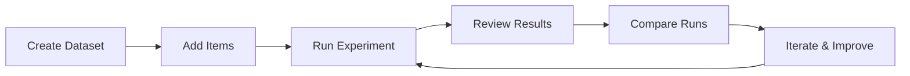

# Datasets Overview

Datasets in AgentTrace are collections of input/expected-output pairs that let you systematically test and evaluate your LLM applications. They provide a structured way to run regression tests, compare model versions, and track quality over time.

## Why Datasets?

LLM applications are non-deterministic by nature. A prompt change, model upgrade, or parameter tweak can silently degrade output quality. Datasets give you a repeatable benchmark to catch regressions before they reach production.

| Challenge | How Datasets Help |
|-----------|-------------------|
| Non-deterministic outputs | Consistent test cases across runs |
| Silent quality regressions | Side-by-side comparison of results |
| Subjective evaluation | Structured scoring with expected outputs |
| Lack of test coverage | Curated edge cases and failure modes |

## Core Concepts

### Dataset

A dataset is a named collection of test items belonging to a project. Each dataset tracks how many items it contains and how many experiment runs have been executed against it.

```json
{
  "id": "dataset-uuid",
  "name": "code-review-tests",
  "description": "Test cases for code review agent",
  "itemCount": 25,
  "runCount": 4
}
```

### Dataset Item

Each item represents a single test case with an input, an expected output, and optional metadata for categorization.

```json
{
  "input": { "code": "def add(a, b): return a + b", "language": "python" },
  "expectedOutput": { "issues": [], "suggestions": ["Add type hints"] },
  "metadata": { "category": "simple-function", "difficulty": "easy" }
}
```

Items can also be created from production traces using `sourceTraceId`, letting you turn real-world interactions into test cases.

### Experiment Run

A run executes your LLM application against every item in a dataset and records the results. Each run captures the actual output and links it back to the trace that produced it, enabling deep inspection of failures.

### Run Item

A run item connects a dataset item to its execution result, including the actual output and the trace ID for full observability.

## Typical Workflow



1. **Create a dataset** with a descriptive name and purpose.
2. **Add items** — manually, via CSV/JSON import, or from production traces.
3. **Run an experiment** — execute your application against all items.
4. **Review results** — inspect match rates, similarity scores, and individual failures.
5. **Compare runs** — see how changes impact quality across the full test suite.
6. **Iterate** — adjust prompts, models, or parameters and run again.

## When to Use Datasets

- **Regression testing** — verify that prompt or model changes don't degrade quality.
- **Model comparison** — evaluate GPT-4 vs. Claude vs. open-source models on identical inputs.
- **Prompt engineering** — measure the impact of prompt template changes quantitatively.
- **CI/CD integration** — run dataset experiments as part of your deployment pipeline.
- **Compliance & auditing** — maintain a documented record of model behavior over time.

## Getting Started

Ready to build your first dataset? Continue to the next guides:

- [Creating Datasets](./creating-datasets.md) — build and populate datasets via the UI and SDK.
- [Running Experiments](./running-experiments.md) — execute your application against a dataset.
- [Comparing Results](./comparing-results.md) — analyze and compare experiment runs.

## Related Documentation

- [Evaluation Framework](../evaluation/overview.md) — score and evaluate trace outputs.
- [Python SDK](../sdks/python.md) — Python SDK dataset methods.
- [TypeScript SDK](../sdks/typescript.md) — TypeScript SDK dataset methods.
