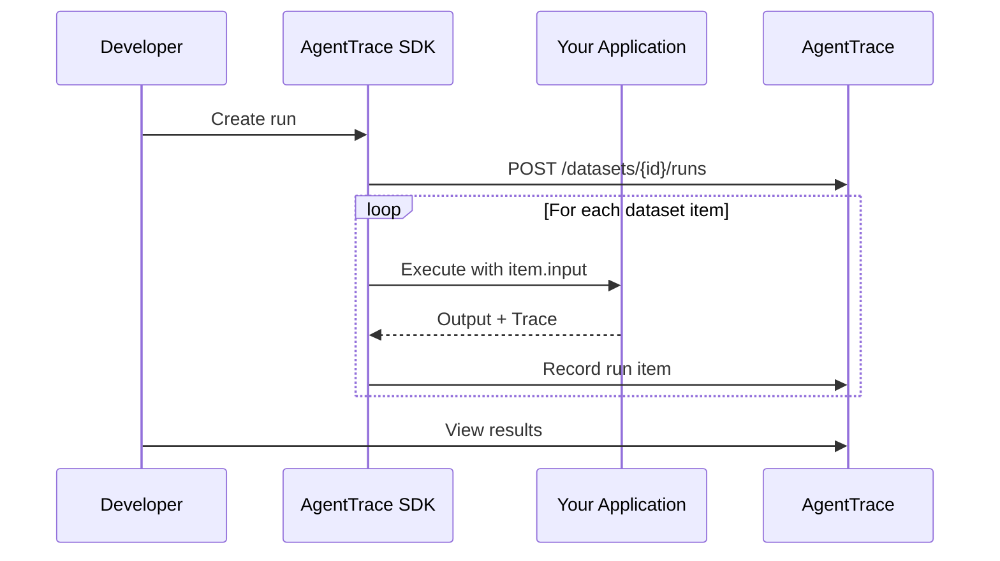

# Running Experiments

An experiment run executes your LLM application against every item in a dataset, records the outputs, and links each result to its full trace for inspection.

## Experiment Workflow



1. **Create a run** — give it a descriptive name that identifies what changed (e.g., `gpt4-improved-prompt-v2`).
2. **Iterate over items** — for each item, run your application with the item's input.
3. **Record results** — capture the output and the trace ID for each execution.
4. **Review** — inspect results in the dashboard or via the API.

## Running via the API

### Create a Run

```bash
curl -X POST "https://api.agenttrace.io/v1/datasets/{datasetId}/runs" \
  -H "Authorization: Bearer at-your-api-key" \
  -H "Content-Type: application/json" \
  -d '{
    "name": "gpt4-improved-prompt-v2",
    "description": "Testing GPT-4 with refined system prompt"
  }'
```

### Record Results

After executing each item through your application:

```bash
curl -X POST "https://api.agenttrace.io/v1/datasets/runs/{runId}/items" \
  -H "Authorization: Bearer at-your-api-key" \
  -H "Content-Type: application/json" \
  -d '{
    "datasetItemId": "item-uuid-1",
    "traceId": "trace-from-execution",
    "output": { "summary": "AgentTrace provides LLM observability." }
  }'
```

## Running via the Python SDK

The Python SDK provides a streamlined way to run experiments with automatic tracing:

```python
from agenttrace import AgentTrace

client = AgentTrace()

def my_summarizer(input_data: dict) -> dict:
    """Your LLM application logic."""
    document = input_data["document"]
    summary = call_llm(f"Summarize: {document}")
    return {"summary": summary}

# Create a run
dataset_id = "dataset-uuid"
run = client.create_dataset_run(
    dataset_id=dataset_id,
    name="gpt4-improved-prompt-v2",
    description="Testing GPT-4 with refined system prompt"
)

# Execute against all items
for item in client.list_dataset_items(dataset_id):
    with client.trace("summarization") as trace:
        output = my_summarizer(item.input)
        trace.update(output=output)

    client.create_run_item(
        run_id=run.id,
        dataset_item_id=item.id,
        trace_id=trace.id,
        output=output
    )

# Check results
results = client.get_run_results(run.id)
print(f"Match rate: {results.summary.match_rate}")
print(f"Avg similarity: {results.summary.avg_similarity}")
```

## Running via the TypeScript SDK

```typescript
import { AgentTrace } from '@agenttrace/sdk';

const client = new AgentTrace({ apiKey: 'at-your-api-key' });

async function mySummarizer(input: Record<string, any>) {
  const summary = await callLlm(`Summarize: ${input.document}`);
  return { summary };
}

const datasetId = 'dataset-uuid';
const run = await client.createDatasetRun({
  datasetId,
  name: 'gpt4-improved-prompt-v2',
  description: 'Testing GPT-4 with refined system prompt',
});

const items = await client.listDatasetItems(datasetId);
for (const item of items) {
  const trace = client.trace({ name: 'summarization' });
  const output = await mySummarizer(item.input);
  trace.end({ output });

  await client.createRunItem({
    runId: run.id,
    datasetItemId: item.id,
    traceId: trace.id,
    output,
  });
}

const results = await client.getRunResults(run.id);
console.log(`Match rate: ${results.summary.matchRate}`);
```

## Scoring Results

Each run item is automatically compared against the expected output. AgentTrace computes:

| Metric | Description |
|--------|-------------|
| `match` | Boolean — does the actual output exactly match the expected output? |
| `similarity` | Float (0–1) — semantic similarity between actual and expected outputs. |

You can also attach custom scores to individual run items using [evaluators](../evaluation/overview.md) or the Scores API.

## Best Practices

- **Descriptive run names** — include the model, prompt version, or parameter that changed (e.g., `claude3-temp0.5`).
- **One variable at a time** — change only one thing per run so you can attribute differences.
- **Baseline first** — always create a baseline run before making changes.
- **Use tracing** — wrap each execution in a trace so you can drill into failures.
- **Automate in CI** — run experiments in your CI/CD pipeline to catch regressions on every deploy.
