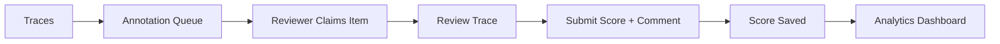

# Human Annotation

Human annotation provides the highest-quality evaluation labels by having human reviewers inspect traces and score them manually. AgentTrace provides annotation queues, a review interface, and workflow management to make this process efficient.

## Why Human Annotation?

- **Ground truth** — human labels serve as the gold standard for calibrating automated evaluators.
- **Subjective quality** — nuanced criteria like tone, creativity, and user satisfaction are best assessed by humans.
- **Edge cases** — automated evaluators may miss subtle issues that humans catch immediately.
- **Training data** — human annotations can be used to fine-tune models or improve prompts.

## Annotation Queue Workflow



## Creating an Annotation Queue

### Via the Dashboard

1. Navigate to **Evaluation** → **Annotation Queues** in the sidebar.
2. Click **+ New Queue**.
3. Configure the queue:

| Field | Description |
|-------|-------------|
| **Name** | Descriptive name (e.g., `Quality Review Queue`) |
| **Description** | Instructions for reviewers |
| **Score Name** | The score key (e.g., `human-quality`) |
| **Score Data Type** | `NUMERIC`, `BOOLEAN`, or `CATEGORICAL` |
| **Score Range** | Min/max values for numeric scores |

4. Click **Create**.

### Via the API

```bash
curl -X POST "https://api.agenttrace.io/v1/annotation-queues" \
  -H "Authorization: Bearer at-your-api-key" \
  -H "Content-Type: application/json" \
  -d '{
    "name": "Quality Review Queue",
    "description": "Rate response quality on a 0-1 scale. Focus on accuracy and helpfulness.",
    "scoreName": "human-quality",
    "scoreConfig": {
      "dataType": "NUMERIC",
      "minValue": 0,
      "maxValue": 1,
      "description": "0 = poor, 0.5 = acceptable, 1.0 = excellent"
    }
  }'
```

## Adding Traces to a Queue

Traces can be added to annotation queues in several ways:

- **Manually** — select traces in the dashboard and click **Add to Queue**.
- **Automatically** — configure rules to route specific traces (e.g., low-confidence outputs or flagged traces).
- **Via API** — programmatically add traces for review.

```bash
curl -X POST "https://api.agenttrace.io/v1/annotation-queues/{queueId}/items" \
  -H "Authorization: Bearer at-your-api-key" \
  -H "Content-Type: application/json" \
  -d '{
    "traceId": "trace-abc-123",
    "observationId": null
  }'
```

## Reviewing Traces

### The Review Interface

1. Navigate to **Evaluation** → **Annotation Queues** and select a queue.
2. Click **Start Reviewing** to claim the next pending item.
3. The review interface shows:
   - **Trace input and output** — the full conversation or data processed.
   - **Observation timeline** — all spans and generations within the trace.
   - **Existing scores** — any automated scores already attached.
   - **Scoring controls** — input field for your score and a comment box.

4. Enter your score, add an optional comment explaining your reasoning, and click **Submit**.
5. The next item is automatically presented.

### Getting the Next Item via API

```bash
curl "https://api.agenttrace.io/v1/annotation-queues/{queueId}/next" \
  -H "Authorization: Bearer at-your-api-key"
```

### Completing an Annotation

```bash
curl -X POST "https://api.agenttrace.io/v1/annotation-queues/{queueId}/items/{itemId}/complete" \
  -H "Authorization: Bearer at-your-api-key" \
  -H "Content-Type: application/json" \
  -d '{
    "value": 0.85,
    "comment": "Accurate response with good structure. Minor issue with formatting."
  }'
```

## Queue Management Dashboard

The annotation queue dashboard provides:

| Metric | Description |
|--------|-------------|
| **Pending** | Items waiting for review |
| **In Progress** | Items currently being reviewed |
| **Completed** | Items that have been scored |
| **Avg Score** | Mean score across completed items |
| **Reviewers** | Number of active reviewers |

Use these metrics to monitor annotation progress and allocate reviewer time effectively.

## Categorical Annotations

For categorical scoring, reviewers select from predefined options:

```bash
curl -X POST "https://api.agenttrace.io/v1/annotation-queues/{queueId}/items/{itemId}/complete" \
  -H "Authorization: Bearer at-your-api-key" \
  -H "Content-Type: application/json" \
  -d '{
    "stringValue": "acceptable",
    "comment": "Response meets basic requirements but could be more detailed."
  }'
```

## Best Practices

- **Write clear guidelines** — include the score description, examples of each score level, and edge case instructions in the queue description.
- **Use separate queues for different criteria** — create one queue per evaluation dimension (quality, accuracy, tone).
- **Calibrate regularly** — have multiple reviewers score the same items periodically to check inter-annotator agreement.
- **Start with a pilot** — annotate a small batch first, review the scores, and refine guidelines before scaling up.
- **Combine with LLM-as-Judge** — use human annotations to validate and calibrate your automated evaluators.
- **Add context** — when adding traces to a queue, include metadata about why the trace was flagged for review.
