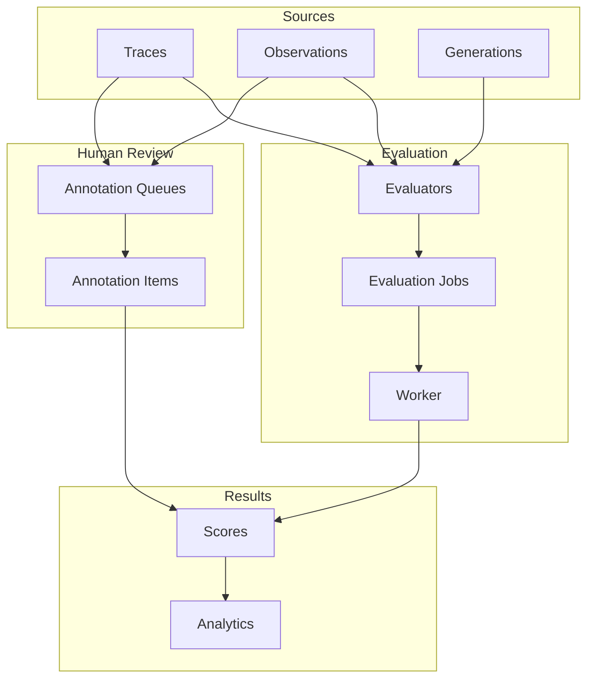
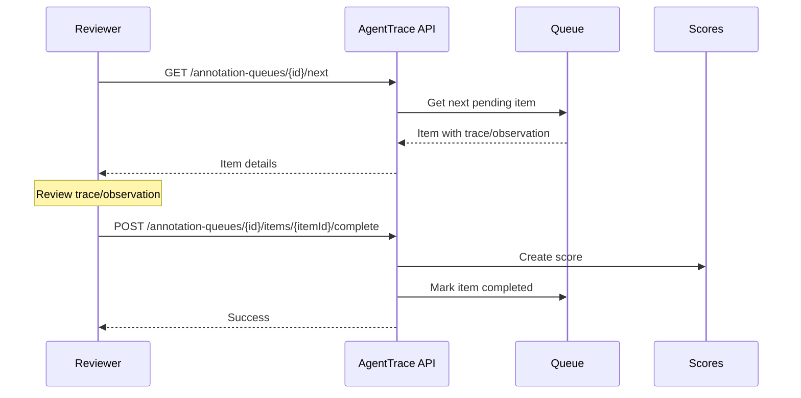

# Evaluation Framework

AgentTrace provides a comprehensive evaluation framework for assessing AI agent performance through automated LLM-as-judge evaluations, rule-based checks, and human annotation workflows.

## Overview



## Concepts

### Evaluators

Evaluators are automated assessment rules that analyze traces and observations to produce scores. AgentTrace supports three types:

| Type | Description | Use Case |
|------|-------------|----------|
| `LLM_AS_JUDGE` | Uses an LLM to evaluate outputs | Quality assessment, factual accuracy |
| `RULE_BASED` | Programmatic rules and patterns | Format validation, keyword detection |
| `HUMAN` | Human annotation workflow | Subjective quality, edge cases |

### Scores

Scores are the output of evaluations, supporting multiple data types:

| Data Type | Description | Example |
|-----------|-------------|---------|
| `NUMERIC` | Floating-point values | `0.85`, `0.0-1.0` |
| `BOOLEAN` | Binary true/false | `1` (true), `0` (false) |
| `CATEGORICAL` | Discrete categories | `"good"`, `"acceptable"`, `"poor"` |

### Score Sources

Scores can originate from different sources:

| Source | Description |
|--------|-------------|
| `API` | Programmatically submitted via SDK |
| `ANNOTATION` | Human annotation through queues |
| `EVAL` | Automated evaluator |

## Creating Evaluators

### REST API

```bash
# Create an LLM-as-judge evaluator
curl -X POST "https://api.agenttrace.io/v1/evaluators" \
  -H "Authorization: Bearer at-your-api-key" \
  -H "Content-Type: application/json" \
  -d '{
    "name": "response-quality",
    "description": "Evaluates response quality on a 0-1 scale",
    "type": "LLM_AS_JUDGE",
    "scoreName": "quality",
    "scoreDataType": "NUMERIC",
    "promptTemplate": "Rate the following response on a scale of 0-1...\n\nResponse: {{output}}\n\nScore (0-1):",
    "variables": ["output"],
    "samplingRate": 1.0,
    "enabled": true
  }'
```

### Using Templates

AgentTrace provides built-in evaluator templates for common use cases:

```bash
# List available templates
curl "https://api.agenttrace.io/v1/evaluators/templates" \
  -H "Authorization: Bearer at-your-api-key"

# Create evaluator from template
curl -X POST "https://api.agenttrace.io/v1/evaluators" \
  -H "Authorization: Bearer at-your-api-key" \
  -H "Content-Type: application/json" \
  -d '{
    "name": "helpfulness-eval",
    "scoreName": "helpfulness",
    "templateId": "template-uuid-here"
  }'
```

### Target Filtering

Control which traces/observations get evaluated:

```bash
curl -X POST "https://api.agenttrace.io/v1/evaluators" \
  -H "Authorization: Bearer at-your-api-key" \
  -H "Content-Type: application/json" \
  -d '{
    "name": "gpt4-quality",
    "scoreName": "quality",
    "type": "LLM_AS_JUDGE",
    "promptTemplate": "...",
    "targetFilter": {
      "models": ["gpt-4", "gpt-4-turbo"],
      "names": ["chat-completion"]
    },
    "samplingRate": 0.5
  }'
```

## Running Evaluations

### Automatic Triggering

Evaluators automatically run when new traces or observations are created (if they match the target filter and pass sampling).

### Manual Execution

```bash
# Execute evaluator on specific trace
curl -X POST "https://api.agenttrace.io/v1/evaluators/{evaluatorId}/execute" \
  -H "Authorization: Bearer at-your-api-key" \
  -H "Content-Type: application/json" \
  -d '{
    "traceId": "trace-abc-123"
  }'

# Execute on specific observation
curl -X POST "https://api.agenttrace.io/v1/evaluators/{evaluatorId}/execute" \
  -H "Authorization: Bearer at-your-api-key" \
  -H "Content-Type: application/json" \
  -d '{
    "traceId": "trace-abc-123",
    "observationId": "obs-xyz-789"
  }'
```

### Checking Job Status

```bash
curl "https://api.agenttrace.io/v1/evaluators/jobs/{jobId}" \
  -H "Authorization: Bearer at-your-api-key"
```

Response:
```json
{
  "id": "job-uuid",
  "evaluatorId": "evaluator-uuid",
  "traceId": "trace-abc-123",
  "status": "completed",
  "result": "{\"score\": 0.85, \"reasoning\": \"Response was accurate...\"}",
  "attempts": 1,
  "scheduledAt": "2024-01-15T10:00:00Z",
  "startedAt": "2024-01-15T10:00:01Z",
  "completedAt": "2024-01-15T10:00:05Z"
}
```

## Scores API

### Creating Scores

#### Single Score

```bash
curl -X POST "https://api.agenttrace.io/v1/scores" \
  -H "Authorization: Bearer at-your-api-key" \
  -H "Content-Type: application/json" \
  -d '{
    "traceId": "trace-abc-123",
    "name": "accuracy",
    "value": 0.95,
    "comment": "Response correctly answered all questions"
  }'
```

#### Batch Scores

```bash
curl -X POST "https://api.agenttrace.io/v1/scores/batch" \
  -H "Authorization: Bearer at-your-api-key" \
  -H "Content-Type: application/json" \
  -d '{
    "scores": [
      {"traceId": "trace-1", "name": "quality", "value": 0.8},
      {"traceId": "trace-2", "name": "quality", "value": 0.9},
      {"traceId": "trace-3", "name": "quality", "value": 0.7}
    ]
  }'
```

### Observation-Level Scores

```bash
curl -X POST "https://api.agenttrace.io/v1/scores" \
  -H "Authorization: Bearer at-your-api-key" \
  -H "Content-Type: application/json" \
  -d '{
    "traceId": "trace-abc-123",
    "observationId": "gen-xyz-789",
    "name": "relevance",
    "value": 0.88
  }'
```

### Categorical Scores

```bash
curl -X POST "https://api.agenttrace.io/v1/scores" \
  -H "Authorization: Bearer at-your-api-key" \
  -H "Content-Type: application/json" \
  -d '{
    "traceId": "trace-abc-123",
    "name": "sentiment",
    "dataType": "CATEGORICAL",
    "stringValue": "positive"
  }'
```

### Querying Scores

```bash
# List all scores
curl "https://api.agenttrace.io/v1/scores" \
  -H "Authorization: Bearer at-your-api-key"

# Filter by trace
curl "https://api.agenttrace.io/v1/scores?traceId=trace-abc-123" \
  -H "Authorization: Bearer at-your-api-key"

# Filter by name and source
curl "https://api.agenttrace.io/v1/scores?name=quality&source=EVAL" \
  -H "Authorization: Bearer at-your-api-key"

# Get scores for a specific trace
curl "https://api.agenttrace.io/v1/traces/{traceId}/scores" \
  -H "Authorization: Bearer at-your-api-key"
```

### Score Statistics

```bash
curl "https://api.agenttrace.io/v1/scores/stats?name=quality" \
  -H "Authorization: Bearer at-your-api-key"
```

Response:
```json
{
  "name": "quality",
  "count": 1250,
  "avgValue": 0.78,
  "minValue": 0.12,
  "maxValue": 0.99,
  "medianValue": 0.81
}
```

## User Feedback

For collecting end-user feedback (thumbs up/down, ratings):

```bash
curl -X POST "https://api.agenttrace.io/v1/feedback" \
  -H "Authorization: Bearer at-your-api-key" \
  -H "Content-Type: application/json" \
  -d '{
    "traceId": "trace-abc-123",
    "name": "user-rating",
    "value": 1,
    "dataType": "BOOLEAN",
    "comment": "Very helpful response!"
  }'
```

## Annotation Queues

Human annotation queues allow manual review and scoring of traces.

### Creating a Queue

```bash
curl -X POST "https://api.agenttrace.io/v1/annotation-queues" \
  -H "Authorization: Bearer at-your-api-key" \
  -H "Content-Type: application/json" \
  -d '{
    "name": "Quality Review Queue",
    "description": "Manual review of agent responses",
    "scoreName": "human-quality",
    "scoreConfig": {
      "dataType": "NUMERIC",
      "minValue": 0,
      "maxValue": 1,
      "description": "Rate the quality of the response"
    }
  }'
```

### Listing Queues

```bash
curl "https://api.agenttrace.io/v1/annotation-queues" \
  -H "Authorization: Bearer at-your-api-key"
```

Response:
```json
{
  "data": [
    {
      "id": "queue-uuid",
      "name": "Quality Review Queue",
      "scoreName": "human-quality",
      "pendingCount": 42,
      "completedCount": 158,
      "createdAt": "2024-01-15T10:00:00Z"
    }
  ]
}
```

### Annotation Workflow



### Getting Next Item

```bash
curl "https://api.agenttrace.io/v1/annotation-queues/{queueId}/next" \
  -H "Authorization: Bearer at-your-api-key"
```

Response:
```json
{
  "id": "item-uuid",
  "queueId": "queue-uuid",
  "traceId": "trace-abc-123",
  "observationId": null,
  "status": "PENDING",
  "createdAt": "2024-01-15T10:00:00Z",
  "trace": {
    "id": "trace-abc-123",
    "name": "chat-completion",
    "input": "...",
    "output": "..."
  }
}
```

### Completing Annotation

```bash
# Numeric score
curl -X POST "https://api.agenttrace.io/v1/annotation-queues/{queueId}/items/{itemId}/complete" \
  -H "Authorization: Bearer at-your-api-key" \
  -H "Content-Type: application/json" \
  -d '{
    "value": 0.85,
    "comment": "Good response with minor issues"
  }'

# Categorical score
curl -X POST "https://api.agenttrace.io/v1/annotation-queues/{queueId}/items/{itemId}/complete" \
  -H "Authorization: Bearer at-your-api-key" \
  -H "Content-Type: application/json" \
  -d '{
    "stringValue": "acceptable",
    "comment": "Response met basic requirements"
  }'
```

## SDK Integration

### Python

```python
import agenttrace

client = agenttrace.AgentTrace()

# Submit a score
client.score(
    trace_id="trace-abc-123",
    name="quality",
    value=0.85,
    comment="Good response"
)

# Score within a trace context
with client.trace("my-agent") as trace:
    # ... agent logic ...
    trace.score("task-completion", 1.0)

# Score a generation
with client.trace("my-agent") as trace:
    gen = trace.generation(
        name="chat",
        model="gpt-4",
        input=[{"role": "user", "content": "Hello"}]
    )
    gen.end(output="Hi there!")
    gen.score("relevance", 0.9)
```

### TypeScript

```typescript
import { AgentTrace } from '@agenttrace/sdk';

const client = new AgentTrace({ apiKey: 'at-your-api-key' });

// Submit a score
await client.score({
  traceId: 'trace-abc-123',
  name: 'quality',
  value: 0.85,
  comment: 'Good response'
});

// Score within a trace
const trace = client.trace({ name: 'my-agent' });
// ... agent logic ...
trace.score('task-completion', 1.0);
trace.end();

// Score a generation
const gen = trace.generation({ name: 'chat', model: 'gpt-4' });
gen.end({ output: 'Hi there!' });
trace.score('relevance', 0.9, { observationId: gen.id });
```

### Go

```go
package main

import (
    "context"
    agenttrace "github.com/agenttrace/agenttrace-go"
)

func main() {
    client := agenttrace.New(agenttrace.Config{
        APIKey: "at-your-api-key",
    })
    defer client.Shutdown()

    ctx := context.Background()
    trace := client.Trace(ctx, agenttrace.TraceOptions{Name: "my-agent"})

    // Score the trace
    trace.Score("quality", 0.85, &agenttrace.ScoreAddOptions{
        Comment: "Good response",
    })

    // Score a generation
    gen := trace.Generation(agenttrace.GenerationOptions{
        Name:  "chat",
        Model: "gpt-4",
    })
    gen.End(&agenttrace.GenerationEndOptions{Output: "Hi there!"})

    trace.Score("relevance", 0.9, &agenttrace.ScoreAddOptions{
        ObservationID: gen.ID(),
    })

    trace.End(nil)
}
```

## Best Practices

### Evaluator Design

1. **Start Simple**: Begin with basic evaluators and iterate based on results
2. **Use Sampling**: For high-volume traces, use `samplingRate < 1.0` to control costs
3. **Clear Prompts**: Write unambiguous prompt templates with explicit scoring criteria
4. **Target Carefully**: Use filters to apply evaluators only to relevant traces

### Score Organization

1. **Consistent Naming**: Use consistent score names across evaluators (`quality`, not `response-quality` and `output-quality`)
2. **Document Ranges**: Document what score values mean (e.g., 0.8+ is "good")
3. **Use Data Types**: Choose appropriate data types (boolean for pass/fail, numeric for scales)

### Human Annotation

1. **Clear Guidelines**: Provide annotators with clear scoring criteria
2. **Queue Management**: Create separate queues for different evaluation types
3. **Regular Calibration**: Periodically review inter-annotator agreement

## API Reference

### Evaluator Endpoints

| Method | Endpoint | Description |
|--------|----------|-------------|
| GET | `/v1/evaluators` | List evaluators |
| GET | `/v1/evaluators/templates` | List templates |
| GET | `/v1/evaluators/{id}` | Get evaluator |
| POST | `/v1/evaluators` | Create evaluator |
| PATCH | `/v1/evaluators/{id}` | Update evaluator |
| DELETE | `/v1/evaluators/{id}` | Delete evaluator |
| POST | `/v1/evaluators/{id}/execute` | Execute evaluator |
| GET | `/v1/evaluators/jobs/{jobId}` | Get job status |

### Score Endpoints

| Method | Endpoint | Description |
|--------|----------|-------------|
| GET | `/v1/scores` | List scores |
| GET | `/v1/scores/stats` | Get score statistics |
| GET | `/v1/scores/{id}` | Get score |
| POST | `/v1/scores` | Create score |
| POST | `/v1/scores/batch` | Batch create scores |
| PATCH | `/v1/scores/{id}` | Update score |
| DELETE | `/v1/scores/{id}` | Delete score |
| GET | `/v1/traces/{traceId}/scores` | Get trace scores |
| POST | `/v1/feedback` | Submit user feedback |

### Annotation Queue Endpoints

| Method | Endpoint | Description |
|--------|----------|-------------|
| GET | `/v1/annotation-queues` | List queues |
| GET | `/v1/annotation-queues/{id}` | Get queue |
| POST | `/v1/annotation-queues` | Create queue |
| GET | `/v1/annotation-queues/{id}/next` | Get next item |
| POST | `/v1/annotation-queues/{id}/items/{itemId}/complete` | Complete annotation |

## Related Documentation

- [Python SDK](../sdks/python.md) - Python SDK scoring methods
- [TypeScript SDK](../sdks/typescript.md) - TypeScript SDK scoring methods
- [Go SDK](../sdks/go.md) - Go SDK scoring methods
- [API Reference](/api-reference/) - Complete API documentation
