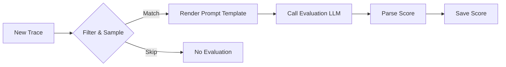

# LLM-as-Judge

LLM-as-Judge evaluators use a separate LLM to assess the quality of your application's outputs. You define the evaluation criteria in a prompt template, choose a model, and AgentTrace handles execution, scoring, and analytics.

## How It Works

1. A new trace or observation is created in AgentTrace.
2. The evaluator checks if the trace matches its target filter and sampling rate.
3. If matched, the evaluator renders the prompt template with trace variables (input, output, metadata).
4. The evaluation LLM produces a score and reasoning.
5. The score is saved and appears in the dashboard.



## Configuring via the UI

1. Navigate to **Evaluation** → **Evaluators** in the sidebar.
2. Click **+ New Evaluator**.
3. Select **LLM-as-Judge** as the type.
4. Configure the evaluator:

| Field | Description |
|-------|-------------|
| **Name** | Descriptive name (e.g., `response-helpfulness`) |
| **Score Name** | The score key stored on traces (e.g., `helpfulness`) |
| **Score Data Type** | `NUMERIC`, `BOOLEAN`, or `CATEGORICAL` |
| **Model** | The LLM to use for evaluation (e.g., `gpt-4`) |
| **Prompt Template** | The evaluation prompt with `{{variable}}` placeholders |
| **Sampling Rate** | Fraction of traces to evaluate (0.0–1.0) |
| **Target Filter** | Optional: limit to specific models or trace names |

5. Click **Save**. The evaluator will begin processing matching traces automatically.

## Prompt Template

The prompt template defines the evaluation criteria. Use `{{variable}}` syntax to inject trace data:

```text
You are an expert evaluator. Rate the quality of the following AI response.

User Input: {{input}}
AI Response: {{output}}

Evaluate on a scale of 0 to 1 where:
- 0.0: Completely incorrect or unhelpful
- 0.5: Partially correct but missing key information
- 1.0: Fully correct, helpful, and well-structured

Respond with ONLY a JSON object:
{"score": <number>, "reasoning": "<explanation>"}
```

### Available Variables

| Variable | Description |
|----------|-------------|
| `{{input}}` | The trace or observation input |
| `{{output}}` | The trace or observation output |
| `{{metadata}}` | Trace metadata as JSON |
| `{{expectedOutput}}` | Expected output (when used with datasets) |

## Configuring via the API

```bash
curl -X POST "https://api.agenttrace.io/v1/evaluators" \
  -H "Authorization: Bearer at-your-api-key" \
  -H "Content-Type: application/json" \
  -d '{
    "name": "response-helpfulness",
    "type": "LLM_AS_JUDGE",
    "scoreName": "helpfulness",
    "scoreDataType": "NUMERIC",
    "promptTemplate": "Rate the helpfulness of this response...\n\nInput: {{input}}\nOutput: {{output}}\n\nRespond with JSON: {\"score\": <0-1>, \"reasoning\": \"...\"}",
    "variables": ["input", "output"],
    "model": "gpt-4",
    "samplingRate": 1.0,
    "enabled": true
  }'
```

## Target Filtering

Limit which traces or observations get evaluated:

```json
{
  "targetFilter": {
    "models": ["gpt-4", "gpt-4-turbo"],
    "names": ["chat-completion", "summarize"]
  }
}
```

Only traces matching the filter will be evaluated. Combined with `samplingRate`, this gives precise control over evaluation cost.

## Using Templates

AgentTrace provides built-in templates for common evaluation criteria:

| Template | Score Type | Description |
|----------|-----------|-------------|
| Helpfulness | Numeric (0–1) | How helpful is the response? |
| Factual Accuracy | Boolean | Is the response factually correct? |
| Toxicity | Boolean | Does the response contain toxic content? |
| Relevance | Numeric (0–1) | How relevant is the response to the input? |
| Conciseness | Categorical | Is the response concise, verbose, or too brief? |

Create an evaluator from a template in the UI by selecting **Use Template** during setup.

## Manual Execution

Run an evaluator on a specific trace without waiting for automatic triggering:

```bash
curl -X POST "https://api.agenttrace.io/v1/evaluators/{evaluatorId}/execute" \
  -H "Authorization: Bearer at-your-api-key" \
  -H "Content-Type: application/json" \
  -d '{ "traceId": "trace-abc-123" }'
```

## Viewing Results

Scores from LLM-as-Judge evaluators appear:

- On the **trace detail page** under the Scores section.
- In the **Evaluation** dashboard with aggregate statistics.
- Via the **Scores API** for programmatic access.

## Best Practices

- **Be explicit in your prompt** — include clear scoring criteria with examples of each score level.
- **Use sampling for high-volume traces** — set `samplingRate` below 1.0 to control costs.
- **Start with built-in templates** — customize after you understand the baseline behavior.
- **Validate with human annotation** — periodically compare LLM-as-Judge scores against human labels to ensure alignment.
- **Choose the right model** — use a more capable model (e.g., GPT-4) for nuanced evaluation, even if your application uses a lighter model.
