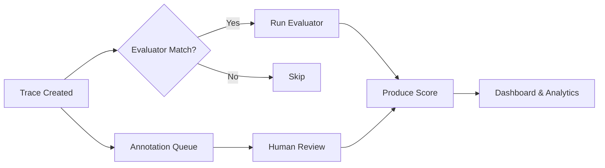

# Evaluation Overview

AgentTrace provides a comprehensive evaluation framework for assessing the quality of your LLM application outputs. Evaluation is essential for understanding whether your agents are performing as expected, catching regressions, and improving over time.

## Why Evaluate?

LLM outputs are non-deterministic. The same input can produce different outputs across runs, making it critical to have systematic evaluation in place:

- **Quality assurance** — verify outputs meet your standards before reaching users.
- **Regression detection** — catch quality drops after prompt, model, or code changes.
- **Continuous improvement** — quantify the impact of optimizations.
- **Compliance** — maintain auditable records of output quality.

## Three Evaluation Approaches

AgentTrace supports three complementary approaches to evaluation. You can use them individually or combine them for comprehensive coverage.

| Approach | Best For | Speed | Cost |
|----------|----------|-------|------|
| [LLM-as-Judge](./llm-as-judge.md) | Subjective quality, factual accuracy | Fast | Moderate (LLM API calls) |
| [Human Annotation](./human-annotation.md) | Edge cases, subjective quality, calibration | Slow | High (human time) |
| [Custom Evaluators](./custom-evaluators.md) | Format validation, deterministic checks | Fastest | Lowest |

### LLM-as-Judge

Use a separate LLM to evaluate the outputs of your application. You define a prompt template with scoring criteria, select a model, and AgentTrace automatically evaluates traces as they arrive.

```
Evaluator: "Rate the helpfulness of this response on a 0-1 scale."
Model: GPT-4
→ Score: 0.85, Reasoning: "Response directly addresses the question..."
```

Best for: quality assessment, factual accuracy, tone evaluation, and any criteria that benefit from language understanding.

### Human Annotation

Route traces to human reviewers through annotation queues. Reviewers inspect the full trace context and provide scores and comments. Human annotation provides the highest-quality labels and is essential for calibrating automated evaluators.

Best for: edge cases, subjective quality, training data for fine-tuning, and establishing ground truth.

### Custom Evaluators

Build deterministic evaluators using regex matching, JSON schema validation, Python functions, or any custom logic. Submit scores via the API for full flexibility.

Best for: format validation, keyword detection, schema compliance, latency checks, and any rule-based criteria.

## Scores

All three approaches produce **scores** — the universal unit of evaluation in AgentTrace. Scores support three data types:

| Data Type | Example | Use Case |
|-----------|---------|----------|
| `NUMERIC` | `0.85` | Quality scales (0–1), latency, cost |
| `BOOLEAN` | `true` / `false` | Pass/fail checks |
| `CATEGORICAL` | `"good"`, `"acceptable"` | Discrete quality levels |

Scores can be attached to traces or individual observations (spans, generations) within a trace.

## Evaluation Pipeline



Evaluators can be triggered automatically when new traces arrive, or executed manually on specific traces. Scores from all sources — automated evaluators, human annotations, and API submissions — flow into the same analytics dashboard.

## Getting Started

1. **[LLM-as-Judge](./llm-as-judge.md)** — set up automated evaluation with an LLM evaluator.
2. **[Human Annotation](./human-annotation.md)** — create annotation queues for manual review.
3. **[Custom Evaluators](./custom-evaluators.md)** — build deterministic rule-based evaluators.

## Related Documentation

- [Datasets & Experiments](../datasets/overview.md) — run structured experiments and compare results.
- [Python SDK — Scores](../sdks/python.md) — submit scores programmatically.
- [TypeScript SDK](../sdks/typescript.md) — TypeScript scoring methods.
