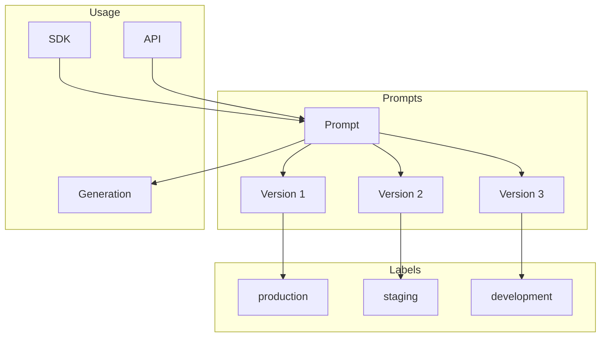
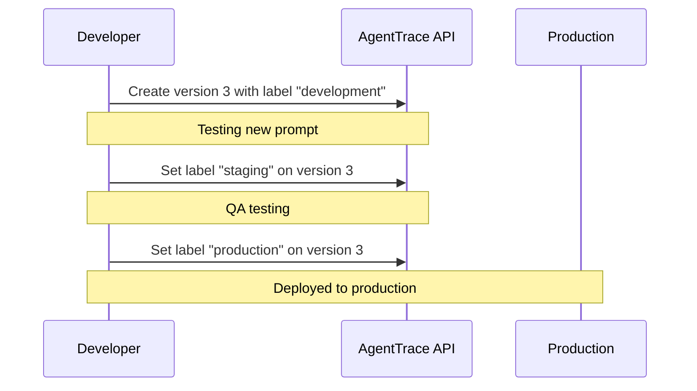

# Prompt Management

AgentTrace provides centralized prompt management with versioning, labels for environment deployment, and variable interpolation.

## Overview



## Concepts

### Prompt Types

| Type | Description | Use Case |
|------|-------------|----------|
| `TEXT` | Single text template | Completions, simple prompts |
| `CHAT` | Array of messages | Chat-based models, conversations |

### Versions

Every change to a prompt creates a new version. Versions are immutable and auto-incremented.

### Labels

Labels are pointers to specific versions, enabling environment-based deployment:

- `production` - Live traffic
- `staging` - Pre-production testing
- `development` - Active development
- Custom labels for A/B testing

### Variables

Variables use `{{variable_name}}` syntax and are extracted automatically:

```
Hello {{user_name}}! Your order {{order_id}} is ready.
```

Extracted variables: `["user_name", "order_id"]`

## Creating Prompts

### REST API

#### Text Prompt

```bash
curl -X POST "https://api.agenttrace.io/v1/prompts" \
  -H "Authorization: Bearer at-your-api-key" \
  -H "Content-Type: application/json" \
  -d '{
    "name": "greeting",
    "type": "TEXT",
    "content": "Hello {{user_name}}! Welcome to our service.",
    "labels": ["production"]
  }'
```

#### Chat Prompt

```bash
curl -X POST "https://api.agenttrace.io/v1/prompts" \
  -H "Authorization: Bearer at-your-api-key" \
  -H "Content-Type: application/json" \
  -d '{
    "name": "code-review",
    "type": "CHAT",
    "content": "[{\"role\": \"system\", \"content\": \"You are a code reviewer. Review the following code for bugs and improvements.\"}, {\"role\": \"user\", \"content\": \"{{code}}\"}]",
    "labels": ["production"],
    "tags": ["code", "review"]
  }'
```

### Response

```json
{
  "id": "uuid-prompt-id",
  "projectId": "uuid-project-id",
  "name": "greeting",
  "type": "TEXT",
  "description": "",
  "tags": [],
  "createdAt": "2024-01-15T10:00:00Z",
  "updatedAt": "2024-01-15T10:00:00Z",
  "latestVersion": {
    "id": "uuid-version-id",
    "promptId": "uuid-prompt-id",
    "version": 1,
    "content": "Hello {{user_name}}! Welcome to our service.",
    "labels": ["production"],
    "variables": ["user_name"],
    "createdAt": "2024-01-15T10:00:00Z"
  }
}
```

## Fetching Prompts

### By Name (Latest Production)

```bash
# Default: Returns production label, or latest if no production label
curl "https://api.agenttrace.io/v1/prompts/greeting" \
  -H "Authorization: Bearer at-your-api-key"
```

### By Label

```bash
curl "https://api.agenttrace.io/v1/prompts/greeting?label=staging" \
  -H "Authorization: Bearer at-your-api-key"
```

### By Version

```bash
curl "https://api.agenttrace.io/v1/prompts/greeting?version=2" \
  -H "Authorization: Bearer at-your-api-key"
```

### List All Prompts

```bash
curl "https://api.agenttrace.io/v1/prompts" \
  -H "Authorization: Bearer at-your-api-key"

# With filters
curl "https://api.agenttrace.io/v1/prompts?tags=code&label=production" \
  -H "Authorization: Bearer at-your-api-key"
```

## Versioning

### Create New Version

```bash
curl -X POST "https://api.agenttrace.io/v1/prompts/greeting/versions" \
  -H "Authorization: Bearer at-your-api-key" \
  -H "Content-Type: application/json" \
  -d '{
    "content": "Hi {{user_name}}! Welcome back to our improved service.",
    "labels": ["staging"],
    "commitMessage": "Improved greeting message"
  }'
```

### List Versions

```bash
curl "https://api.agenttrace.io/v1/prompts/greeting/versions" \
  -H "Authorization: Bearer at-your-api-key"
```

Response:
```json
{
  "data": [
    {
      "id": "uuid-v2",
      "version": 2,
      "content": "Hi {{user_name}}! Welcome back...",
      "labels": ["staging"],
      "variables": ["user_name"],
      "commitMessage": "Improved greeting message",
      "createdAt": "2024-01-16T10:00:00Z"
    },
    {
      "id": "uuid-v1",
      "version": 1,
      "content": "Hello {{user_name}}! Welcome...",
      "labels": ["production"],
      "variables": ["user_name"],
      "createdAt": "2024-01-15T10:00:00Z"
    }
  ],
  "totalCount": 2
}
```

## Labels

### Set Label on Version

```bash
curl -X POST "https://api.agenttrace.io/v1/prompts/greeting/labels" \
  -H "Authorization: Bearer at-your-api-key" \
  -H "Content-Type: application/json" \
  -d '{
    "label": "production",
    "version": 2
  }'
```

This moves the `production` label from version 1 to version 2.

### Remove Label

```bash
curl -X DELETE "https://api.agenttrace.io/v1/prompts/greeting/versions/2/labels/staging" \
  -H "Authorization: Bearer at-your-api-key"
```

### Common Label Workflow



## Compiling Prompts

Compile a prompt with variables server-side:

```bash
curl -X POST "https://api.agenttrace.io/v1/prompts/greeting/compile" \
  -H "Authorization: Bearer at-your-api-key" \
  -H "Content-Type: application/json" \
  -d '{
    "variables": {
      "user_name": "Alice"
    },
    "label": "production"
  }'
```

Response:
```json
{
  "prompt": {
    "id": "uuid-prompt-id",
    "name": "greeting",
    "version": 1
  },
  "compiledContent": "Hello Alice! Welcome to our service.",
  "variables": {
    "user_name": "Alice"
  }
}
```

### Compile Specific Version

```bash
curl -X POST "https://api.agenttrace.io/v1/prompts/greeting/compile" \
  -H "Authorization: Bearer at-your-api-key" \
  -H "Content-Type: application/json" \
  -d '{
    "variables": {
      "user_name": "Bob"
    },
    "version": 2
  }'
```

## SDK Integration

### Python

```python
import agenttrace

client = agenttrace.AgentTrace()

# Fetch prompt (production by default)
prompt = client.get_prompt("greeting")
print(prompt.prompt)           # "Hello {{user_name}}!"
print(prompt.variables)        # ["user_name"]

# Compile with variables
compiled = prompt.compile(user_name="Alice")
print(compiled)  # "Hello Alice!"

# Fetch specific version
prompt_v2 = client.get_prompt("greeting", version=2)

# Fetch by label
staging_prompt = client.get_prompt("greeting", label="staging")

# Use in a generation
with client.trace("my-agent") as trace:
    prompt = client.get_prompt("code-review")
    compiled = prompt.compile(code="def hello(): pass")

    gen = trace.generation(
        name="code-review",
        model="gpt-4",
        input=compiled,
        prompt_id=prompt.id,       # Link to prompt
        prompt_version=prompt.version
    )
    # ... LLM call ...
    gen.end(output="...")
```

### TypeScript

```typescript
import { AgentTrace, getPrompt } from '@agenttrace/sdk';

const client = new AgentTrace({ apiKey: 'at-your-api-key' });

// Fetch prompt
const prompt = await getPrompt({ name: 'greeting' });
console.log(prompt.prompt);     // "Hello {{user_name}}!"
console.log(prompt.variables);  // ["user_name"]

// Compile with variables
const compiled = prompt.compile({ user_name: 'Alice' });
console.log(compiled);  // "Hello Alice!"

// Fetch specific version
const promptV2 = await getPrompt({ name: 'greeting', version: 2 });

// Fetch by label
const stagingPrompt = await getPrompt({ name: 'greeting', label: 'staging' });

// Use in a generation
const trace = client.trace({ name: 'my-agent' });
const reviewPrompt = await getPrompt({ name: 'code-review' });
const compiledPrompt = reviewPrompt.compile({ code: 'def hello(): pass' });

const gen = trace.generation({
  name: 'code-review',
  model: 'gpt-4',
  input: compiledPrompt,
  promptId: reviewPrompt.id,
  promptVersion: reviewPrompt.version
});
// ... LLM call ...
gen.end({ output: '...' });
trace.end();
```

### Go

```go
package main

import (
    "context"
    "fmt"

    agenttrace "github.com/agenttrace/agenttrace-go"
)

func main() {
    client := agenttrace.New(agenttrace.Config{
        APIKey: "at-your-api-key",
    })
    defer client.Shutdown()

    // Fetch prompt (production by default)
    prompt, err := agenttrace.GetPrompt(agenttrace.GetPromptOptions{
        Name: "greeting",
    })
    if err != nil {
        panic(err)
    }
    fmt.Println(prompt.Prompt)    // "Hello {{user_name}}!"
    fmt.Println(prompt.Variables) // ["user_name"]

    // Compile with variables
    compiled := prompt.Compile(map[string]any{
        "user_name": "Alice",
    })
    fmt.Println(compiled)  // "Hello Alice!"

    // Fetch specific version
    version := 2
    promptV2, _ := agenttrace.GetPrompt(agenttrace.GetPromptOptions{
        Name:    "greeting",
        Version: &version,
    })

    // Fetch by label
    stagingPrompt, _ := agenttrace.GetPrompt(agenttrace.GetPromptOptions{
        Name:  "greeting",
        Label: "staging",
    })

    // Use in a generation
    ctx := context.Background()
    trace := client.Trace(ctx, agenttrace.TraceOptions{Name: "my-agent"})

    reviewPrompt, _ := agenttrace.GetPrompt(agenttrace.GetPromptOptions{
        Name: "code-review",
    })
    compiledPrompt := reviewPrompt.Compile(map[string]any{
        "code": "def hello(): pass",
    })

    gen := trace.Generation(agenttrace.GenerationOptions{
        Name:          "code-review",
        Model:         "gpt-4",
        Input:         compiledPrompt,
        PromptID:      reviewPrompt.ID,
        PromptVersion: reviewPrompt.Version,
    })
    // ... LLM call ...
    gen.End(&agenttrace.GenerationEndOptions{Output: "..."})

    trace.End(nil)
}
```

## Caching

SDKs implement prompt caching to reduce API calls:

```python
# First call fetches from API
prompt1 = client.get_prompt("greeting")

# Subsequent calls use cache (within TTL)
prompt2 = client.get_prompt("greeting")  # Cached!

# Force refresh
prompt3 = client.get_prompt("greeting", cache=False)
```

Default cache TTL: 60 seconds (configurable per SDK)

## Chat Prompts

For chat-based models, use the `CHAT` type with message arrays:

### Creating Chat Prompt

```bash
curl -X POST "https://api.agenttrace.io/v1/prompts" \
  -H "Authorization: Bearer at-your-api-key" \
  -H "Content-Type: application/json" \
  -d '{
    "name": "assistant",
    "type": "CHAT",
    "content": "[{\"role\": \"system\", \"content\": \"You are a helpful assistant.\"}, {\"role\": \"user\", \"content\": \"{{user_message}}\"}]"
  }'
```

### Using Chat Prompts in SDK

```python
# Python
prompt = client.get_prompt("assistant")

# Compile returns list of messages for chat prompts
messages = prompt.compile_chat(user_message="Hello!")
# [
#   {"role": "system", "content": "You are a helpful assistant."},
#   {"role": "user", "content": "Hello!"}
# ]
```

## Best Practices

### Naming Conventions

- Use lowercase with hyphens: `code-review`, `greeting-v2`
- Group related prompts: `agent/task-planning`, `agent/code-generation`
- Be descriptive but concise

### Version Management

1. **Never modify production directly**: Create new versions and test first
2. **Use meaningful commit messages**: Track why changes were made
3. **Test in staging**: Move labels through environments

### Variable Design

1. **Use descriptive names**: `user_name` not `n`, `code_snippet` not `c`
2. **Document expected formats**: In the prompt description
3. **Validate inputs**: Before compiling prompts

### Labels Strategy

| Label | Purpose | Promotion Path |
|-------|---------|---------------|
| `development` | Active changes | → staging |
| `staging` | QA testing | → production |
| `production` | Live traffic | Final |
| `canary` | A/B testing | Optional |

## API Reference

### Prompt Endpoints

| Method | Endpoint | Description |
|--------|----------|-------------|
| GET | `/v1/prompts` | List prompts |
| GET | `/v1/prompts/{name}` | Get prompt by name |
| POST | `/v1/prompts` | Create prompt |
| PATCH | `/v1/prompts/{id}` | Update prompt metadata |
| DELETE | `/v1/prompts/{id}` | Delete prompt |

### Version Endpoints

| Method | Endpoint | Description |
|--------|----------|-------------|
| GET | `/v1/prompts/{name}/versions` | List versions |
| POST | `/v1/prompts/{name}/versions` | Create new version |

### Label Endpoints

| Method | Endpoint | Description |
|--------|----------|-------------|
| POST | `/v1/prompts/{name}/labels` | Set label on version |
| DELETE | `/v1/prompts/{name}/versions/{version}/labels/{label}` | Remove label |

### Compile Endpoint

| Method | Endpoint | Description |
|--------|----------|-------------|
| POST | `/v1/prompts/{name}/compile` | Compile prompt with variables |

### Query Parameters

| Parameter | Type | Description |
|-----------|------|-------------|
| `version` | int | Fetch specific version |
| `label` | string | Fetch version with label |
| `tags` | string | Filter by tags |

## Related Documentation

- [Python SDK](../sdks/python.md) - Python SDK prompt methods
- [TypeScript SDK](../sdks/typescript.md) - TypeScript SDK prompt methods
- [Go SDK](../sdks/go.md) - Go SDK prompt methods
- [Evaluation Framework](../evaluation/) - Using prompts in evaluators
