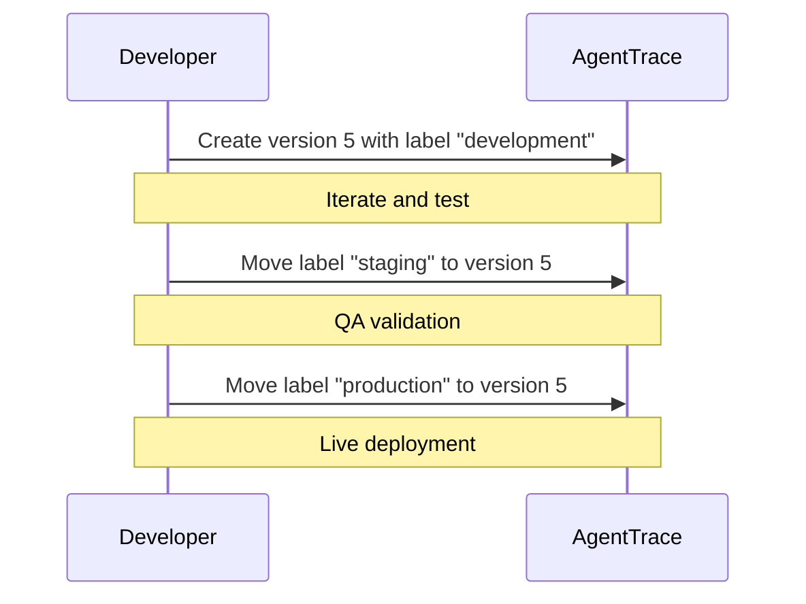

# Prompt Labels

Labels are movable pointers that map a name to a specific prompt version. They enable environment-based deployment, A/B testing, and safe promotion workflows without changing application code.

## How Labels Work

A label is a named reference that points to exactly one version of a prompt. When you fetch a prompt by label, AgentTrace returns the version that label currently points to.

```
Prompt: "code-review"
├── Version 1  ← (no label)
├── Version 2  ← "production"
├── Version 3  ← "staging"
└── Version 4  ← "development", "experiment-a"
```

Moving a label is atomic — it instantly redirects all SDK calls using that label to the new version.

## Built-in Labels

AgentTrace recognizes these conventional labels:

| Label | Purpose | Behavior |
|-------|---------|----------|
| `production` | Live traffic | Default when no label specified |
| `staging` | Pre-production testing | Manual promotion to production |
| `development` | Active iteration | Unstable, latest changes |

## Custom Labels

Create any label for your workflow:

- `canary` — A/B testing a new version with a subset of traffic
- `experiment-a`, `experiment-b` — running prompt experiments
- `rollback` — marking a known-good version for quick recovery
- `review` — version awaiting team review

## Setting Labels

### Via API

```bash
# Move "production" label to version 3
curl -X POST "https://api.agenttrace.io/v1/prompts/code-review/labels" \
  -H "Authorization: Bearer at-your-api-key" \
  -H "Content-Type: application/json" \
  -d '{
    "label": "production",
    "version": 3
  }'
```

### Via Dashboard

1. Navigate to **Prompts > your prompt > Versions**
2. Click the **Label** icon next to the target version
3. Select or type a label name
4. Click **Apply**

### Removing Labels

```bash
curl -X DELETE \
  "https://api.agenttrace.io/v1/prompts/code-review/versions/3/labels/staging" \
  -H "Authorization: Bearer at-your-api-key"
```

## Fetching by Label

### Python SDK

```python
# Fetch the production version (default)
prompt = client.get_prompt("code-review")

# Fetch a specific label
staging = client.get_prompt("code-review", label="staging")
canary = client.get_prompt("code-review", label="canary")
```

### TypeScript SDK

```typescript
const prod = await getPrompt({ name: 'code-review' });
const staging = await getPrompt({ name: 'code-review', label: 'staging' });
```

### Go SDK

```go
prompt, _ := agenttrace.GetPrompt(agenttrace.GetPromptOptions{
    Name:  "code-review",
    Label: "staging",
})
```

## Promotion Workflow

A typical promotion workflow moves a version through environments:



### Rollback

If a production prompt causes issues, instantly roll back:

```bash
# Point production back to the previous known-good version
curl -X POST "https://api.agenttrace.io/v1/prompts/code-review/labels" \
  -H "Authorization: Bearer at-your-api-key" \
  -H "Content-Type: application/json" \
  -d '{"label": "production", "version": 2}'
```

All SDK calls fetching the `production` label immediately receive version 2.

## A/B Testing with Labels

Run experiments by assigning different labels to different versions:

```python
import random

# Randomly select a variant
label = random.choice(["production", "canary"])
prompt = client.get_prompt("code-review", label=label)

# The trace automatically records which version was used
compiled = prompt.compile(code=user_code)
```

Compare results in the AgentTrace evaluation dashboard by filtering traces by prompt version.

## Best Practices

1. **Always use labels in production** — never fetch by version number in deployed code
2. **Keep `production` sacred** — only promote tested versions
3. **Use `staging` for validation** — run evaluations before promoting
4. **Document custom labels** — ensure your team knows the label convention
5. **Monitor after promotion** — watch quality metrics after moving a label

## Related

- [Versioning](./versioning.md) — how versions are created and managed
- [Playground](./playground.md) — test prompt versions interactively
- [Variables](./variables.md) — template variable syntax
