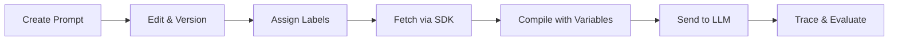

# Prompt Management Overview

AgentTrace provides a centralized prompt management system that brings software engineering best practices — version control, environment promotion, and type-safe compilation — to your AI prompts.

## Why Managed Prompts?

Hardcoding prompts in application code leads to:

- **No visibility** into which prompt version is running in production
- **Risky deployments** — prompt changes require code deployments
- **No rollback** capability when a prompt change degrades quality
- **Difficult collaboration** — prompt engineers and developers work in different systems

AgentTrace solves these by treating prompts as first-class, version-controlled resources.

## Core Concepts

### Prompt Types

| Type | Description | Use Case |
|------|-------------|----------|
| `TEXT` | Single text template | Completions, simple prompts |
| `CHAT` | Array of role-based messages | Chat models, multi-turn conversations |

### Version Control

Every edit to a prompt creates an **immutable version**. Versions are auto-incremented and can never be modified after creation. This gives you a complete audit trail of every change.

### Labels

Labels are movable pointers to specific versions, enabling environment-based deployment:

- `production` — serving live traffic
- `staging` — pre-production validation
- `development` — active iteration
- Custom labels for A/B testing or canary deployments

### Template Variables

Prompts support `{{variable_name}}` syntax for dynamic content injection. Variables are automatically extracted and validated at compile time.

### Compilation

Compile prompts server-side or client-side by substituting variables into templates. The SDKs provide type-safe compilation with automatic variable validation.

## How It Works



1. **Create** a prompt in the dashboard or via API
2. **Iterate** — each save creates a new immutable version
3. **Promote** — move labels (`staging` → `production`) when ready
4. **Fetch** — SDKs retrieve prompts by name, label, or version
5. **Compile** — substitute variables to produce the final prompt text
6. **Observe** — traces automatically link back to the prompt version used

## SDK Integration

All AgentTrace SDKs support prompt management natively:

```python
import agenttrace

client = agenttrace.AgentTrace()

# Fetch the production version
prompt = client.get_prompt("code-review")

# Compile with variables
compiled = prompt.compile(code="def hello(): pass")

# Use in a traced generation
with client.trace("review-agent") as trace:
    gen = trace.generation(
        name="review",
        model="gpt-4",
        input=compiled,
        prompt_id=prompt.id,
        prompt_version=prompt.version,
    )
```

## A/B Testing

Run prompt experiments by assigning multiple labels to different versions:

| Label | Version | Description |
|-------|---------|-------------|
| `production` | v3 | Current baseline |
| `canary-a` | v4 | New system prompt |
| `canary-b` | v5 | Shorter instructions |

Use your SDK to randomly select a label, then compare quality scores in the evaluation dashboard.

## Next Steps

- [Versioning](./versioning.md) — deep dive into version management
- [Labels](./labels.md) — label strategies and workflows
- [Playground](./playground.md) — test prompts interactively
- [Variables](./variables.md) — template variable syntax and compilation
