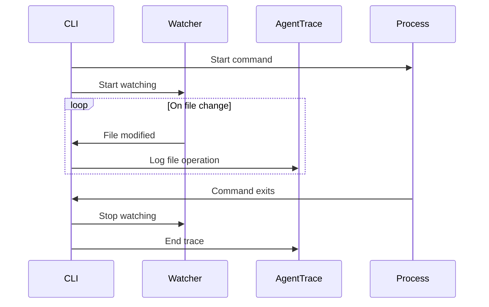
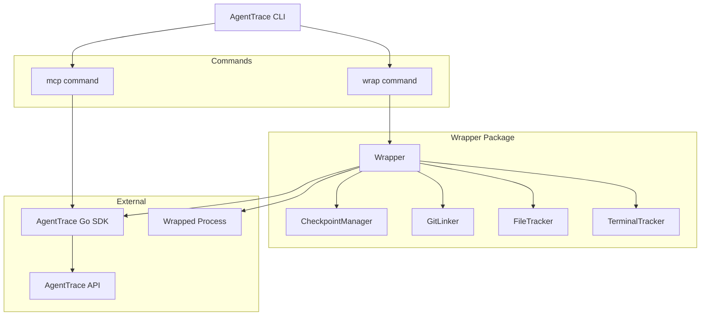

# AgentTrace CLI

The AgentTrace CLI provides command-line tools for tracing any command-line tool or AI coding agent.

## Installation

### From Source

```bash
go install github.com/agenttrace/agenttrace-cli@latest
```

### From Binary

Download the latest release from [GitHub Releases](https://github.com/agenttrace/agenttrace/releases) and add it to your PATH.

### Verify Installation

```bash
agenttrace --version
```

## Configuration

### API Key

Set your API key via environment variable (recommended):

```bash
export AGENTTRACE_API_KEY="at-your-api-key"
```

Or pass it as a flag:

```bash
agenttrace --api-key "at-your-api-key" wrap -- python agent.py
```

### Custom Host

For self-hosted deployments:

```bash
export AGENTTRACE_HOST="https://your-agenttrace-instance.com"
# or
agenttrace --host "https://your-agenttrace-instance.com" wrap -- python agent.py
```

## Commands

### `wrap` - Trace Command Execution

The `wrap` command wraps any command-line tool and automatically traces its execution.

```bash
agenttrace wrap [flags] -- command [args...]
```

#### Basic Usage

```bash
# Trace a Python script
agenttrace wrap -- python agent.py

# Trace an npm command
agenttrace wrap -- npm run dev

# Trace a shell script
agenttrace wrap -- ./build.sh
```

#### Flags

| Flag | Type | Default | Description |
|------|------|---------|-------------|
| `--name` | string | command name | Custom trace name |
| `--user-id` | string | - | User ID for the trace |
| `--session-id` | string | - | Session ID for the trace |
| `--tags` | string[] | - | Tags for the trace (comma-separated) |
| `--watch` | bool | false | Watch for file changes |
| `--checkpoints` | bool | false | Create checkpoints on file changes |
| `--git` | bool | false | Auto-link to git commits |
| `--capture-stdout` | bool | true | Capture stdout |
| `--capture-stderr` | bool | true | Capture stderr |

#### Examples

```bash
# Custom trace name with user ID
agenttrace wrap --name "code-review" --user-id "user-123" -- ./review.sh

# With file watching and checkpoints
agenttrace wrap --watch --checkpoints -- npm run dev

# With git auto-linking
agenttrace wrap --git -- git commit -m "fix bug"

# With tags
agenttrace wrap --tags "production,v2.1" -- python deploy.py

# Full featured
agenttrace wrap \
  --name "agent-run" \
  --user-id "dev-1" \
  --session-id "session-abc" \
  --tags "experiment,gpt4" \
  --watch \
  --checkpoints \
  --git \
  -- python agent.py
```

### `mcp` - MCP Server Mode

The `mcp` command starts a Model Context Protocol (MCP) server for IDE integration.

```bash
agenttrace mcp [flags]
```

#### Flags

| Flag | Type | Default | Description |
|------|------|---------|-------------|
| `--port` | int | 8765 | Port to run the MCP server on |

#### Usage

```bash
agenttrace mcp --port 8080
```

#### Available MCP Tools

The MCP server exposes the following tools for AI assistants:

| Tool | Description |
|------|-------------|
| `agenttrace_trace_start` | Start a new trace for tracking agent execution |
| `agenttrace_trace_end` | End the current trace |
| `agenttrace_generation` | Log an LLM generation/completion |
| `agenttrace_score` | Submit a score for the current trace |
| `agenttrace_prompt_get` | Fetch a prompt by name |

#### MCP Tool Schemas

**agenttrace_trace_start**
```json
{
  "name": "string (required)",
  "user_id": "string (optional)",
  "session_id": "string (optional)"
}
```

**agenttrace_trace_end**
```json
{
  "output": "string (optional)"
}
```

**agenttrace_generation**
```json
{
  "name": "string (required)",
  "model": "string (required)",
  "input": "string (optional)",
  "output": "string (optional)",
  "input_tokens": "integer (optional)",
  "output_tokens": "integer (optional)"
}
```

**agenttrace_score**
```json
{
  "name": "string (required)",
  "value": "number (required, 0-1)",
  "comment": "string (optional)"
}
```

**agenttrace_prompt_get**
```json
{
  "name": "string (required)",
  "version": "integer (optional)",
  "label": "string (optional)",
  "variables": "object (optional)"
}
```

## Features

### File Watching

When `--watch` is enabled, the CLI monitors file changes in the current directory:

```bash
agenttrace wrap --watch -- npm run dev
```

The watcher:
- Monitors the current working directory recursively
- Skips hidden files and common build artifacts (`.pyc`, `.swp`)
- Logs file changes to the trace



### Checkpoints

When `--checkpoints` is enabled alongside `--watch`, automatic checkpoints are created on file changes:

```bash
agenttrace wrap --watch --checkpoints -- python agent.py
```

Checkpoints:
- Track file state changes using SHA256 hashes
- Create checkpoint events when monitored files are modified
- Include git information when available

### Git Auto-Linking

When `--git` is enabled, the CLI automatically links traces to git state:

```bash
agenttrace wrap --git -- python agent.py
```

Git information captured:
- Current branch
- Current commit SHA
- Repository root
- Dirty/clean status (uncommitted changes)

The CLI also detects:
- New commits created during execution
- Branch changes during execution

```bash
# Example: Tracing a git commit
agenttrace wrap --git -- git commit -m "feat: add new feature"
# The trace will include a git link to the new commit
```

### Output Capture

By default, both stdout and stderr are captured and included in the trace:

```bash
# Disable stdout capture
agenttrace wrap --capture-stdout=false -- python noisy_script.py

# Disable stderr capture
agenttrace wrap --capture-stderr=false -- python script.py
```

Output is automatically truncated to 10KB to prevent excessive data storage.

## Architecture



## IDE Integration

### VS Code

Add to your VS Code settings or `.vscode/settings.json`:

```json
{
  "claude.mcpServers": {
    "agenttrace": {
      "command": "agenttrace",
      "args": ["mcp", "--port", "8765"]
    }
  }
}
```

### Cursor

Add to your Cursor configuration:

```json
{
  "mcp": {
    "servers": {
      "agenttrace": {
        "command": "agenttrace",
        "args": ["mcp"]
      }
    }
  }
}
```

### Generic MCP Client

Connect to the MCP server endpoints:

```bash
# Start the server
agenttrace mcp --port 8765

# Endpoints available:
# GET  /mcp/capabilities - Server capabilities
# GET  /mcp/tools/list   - List available tools
# POST /mcp/tools/call   - Call a tool
# GET  /health           - Health check
```

## Environment Variables

| Variable | Description |
|----------|-------------|
| `AGENTTRACE_API_KEY` | API key for authentication |
| `AGENTTRACE_HOST` | API host URL (default: `https://api.agenttrace.io`) |

## Global Flags

| Flag | Short | Description |
|------|-------|-------------|
| `--api-key` | - | AgentTrace API key |
| `--host` | - | AgentTrace API host |
| `--verbose` | `-v` | Enable verbose output |
| `--version` | - | Print version information |
| `--help` | `-h` | Print help information |

## Troubleshooting

### API Key Not Found

```
Error: API key required. Set --api-key or AGENTTRACE_API_KEY
```

**Solution:** Set your API key:
```bash
export AGENTTRACE_API_KEY="at-your-api-key"
```

### Command Not Found After Installation

**Solution:** Ensure `$GOPATH/bin` is in your PATH:
```bash
export PATH="$PATH:$(go env GOPATH)/bin"
```

### File Watcher Errors

If file watching fails:
1. Check file permissions
2. Verify the directory exists
3. On macOS, you may need to increase the file descriptor limit:
   ```bash
   ulimit -n 10240
   ```

### MCP Server Connection Issues

1. Verify the server is running:
   ```bash
   curl http://localhost:8765/health
   ```

2. Check if the port is in use:
   ```bash
   lsof -i :8765
   ```

3. Try a different port:
   ```bash
   agenttrace mcp --port 8766
   ```

### Verbose Mode

For debugging, enable verbose output:
```bash
agenttrace --verbose wrap -- python agent.py
```

This will print detailed information about:
- Trace creation
- File changes detected
- Git operations
- API communication

## Examples

### Tracing a Python AI Agent

```bash
# Basic tracing
agenttrace wrap -- python agent.py

# With full observability
agenttrace wrap \
  --name "claude-agent" \
  --user-id "developer" \
  --watch \
  --checkpoints \
  --git \
  -- python agent.py --task "review code"
```

### Tracing a Node.js Application

```bash
# Development server with file watching
agenttrace wrap --watch -- npm run dev

# Build process with checkpoints
agenttrace wrap --name "build" --checkpoints -- npm run build
```

### CI/CD Integration

```yaml
# GitHub Actions example
- name: Run AI Agent
  env:
    AGENTTRACE_API_KEY: ${{ secrets.AGENTTRACE_API_KEY }}
  run: |
    agenttrace wrap \
      --name "ci-agent-${{ github.run_id }}" \
      --tags "ci,${{ github.ref_name }}" \
      --git \
      -- python agent.py
```

### Shell Script Tracing

```bash
#!/bin/bash
# deploy.sh - Traced deployment script

agenttrace wrap \
  --name "deployment" \
  --user-id "$DEPLOYER" \
  --tags "production,$(date +%Y%m%d)" \
  --git \
  -- ./deploy-steps.sh
```

## Related Documentation

- [Go SDK](./go.md) - For programmatic Go integration
- [TypeScript SDK](./typescript.md) - For Node.js applications
- [Python SDK](./python.md) - For Python applications
- [API Reference](/api-reference/) - REST API documentation
